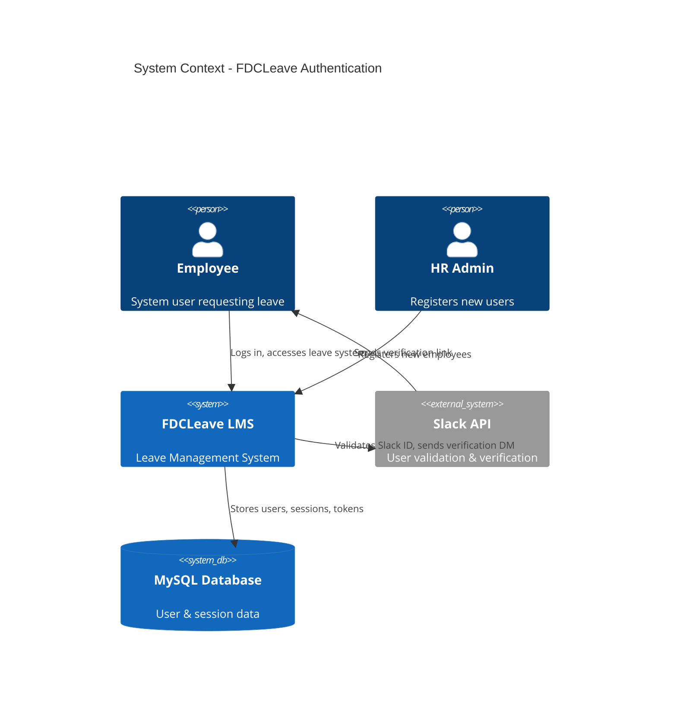
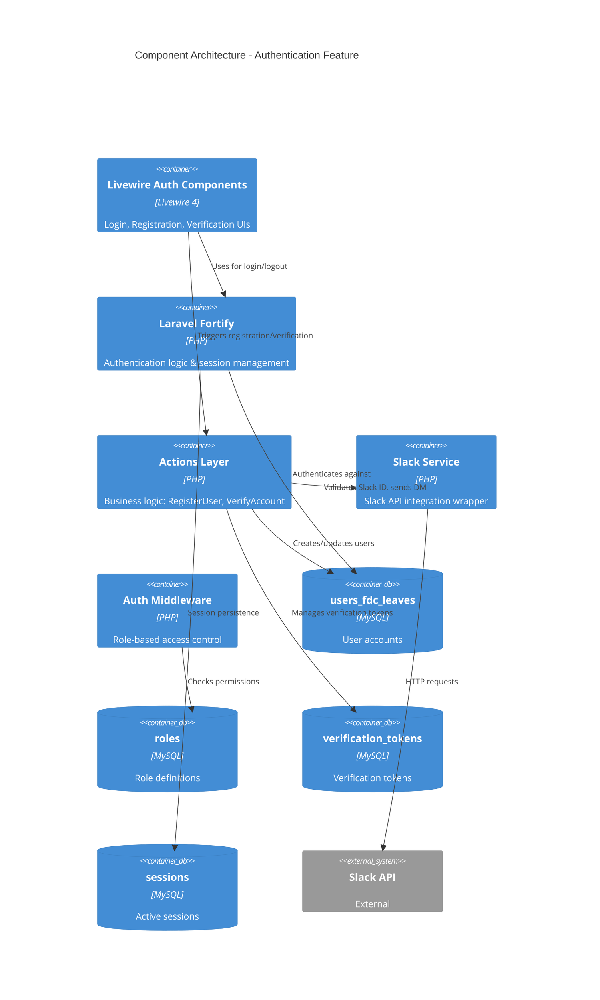
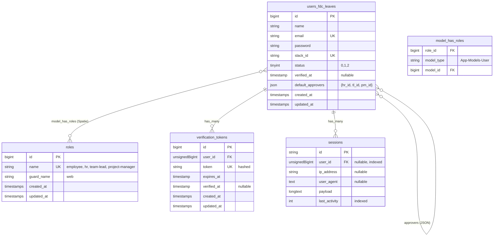
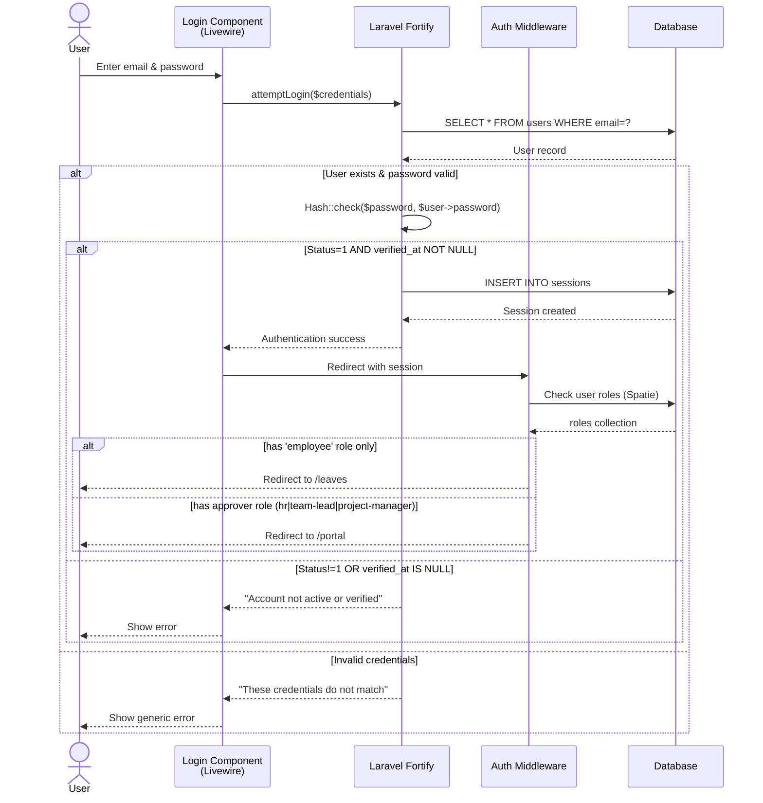
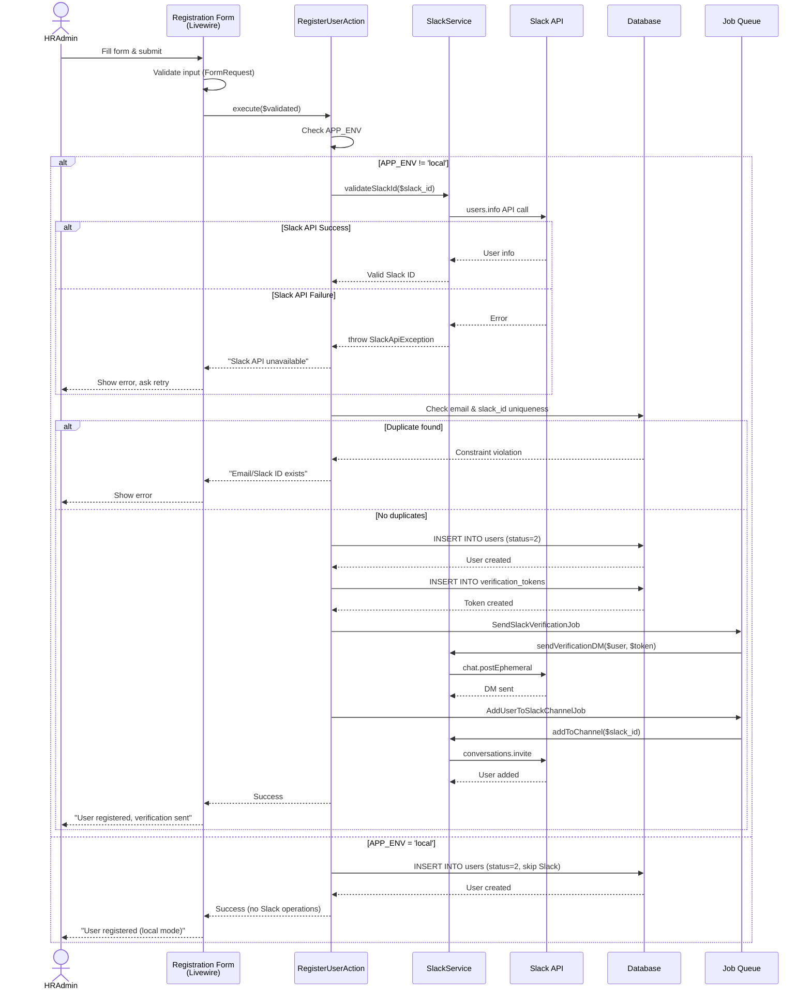
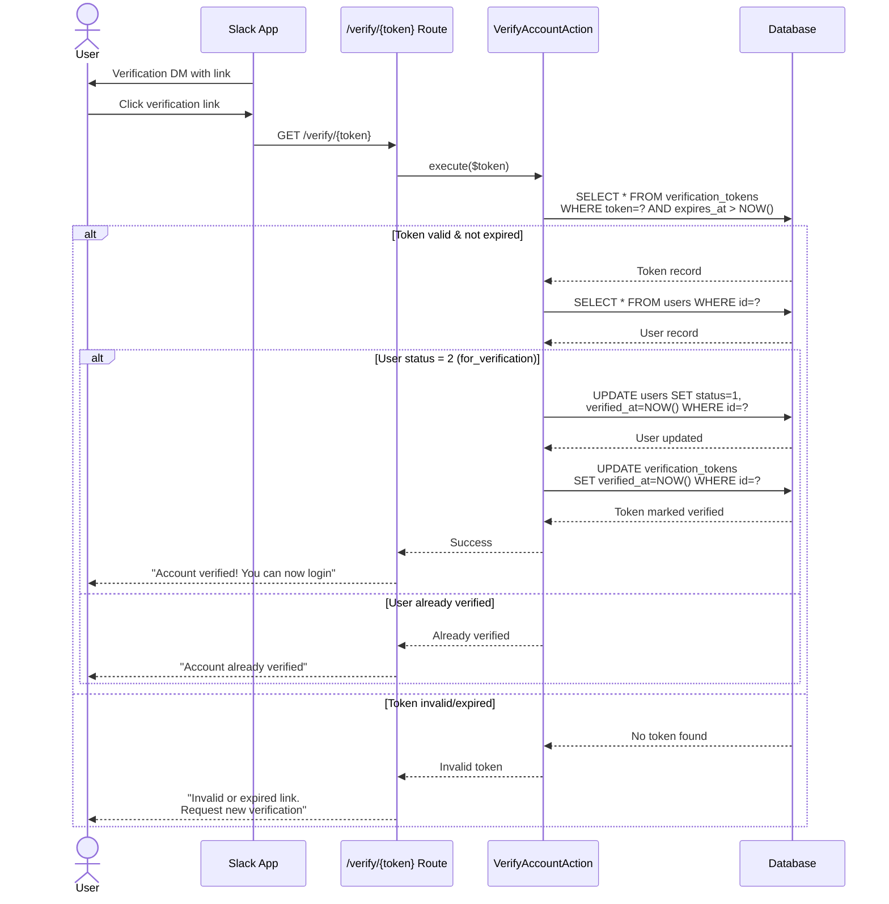
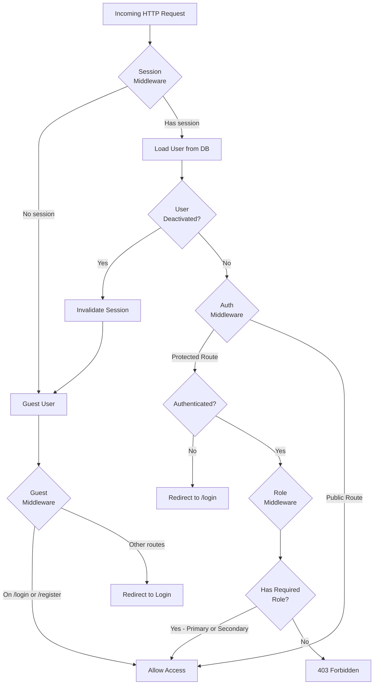

# Implementation Plan: Authentication System - Login & Registration

**Branch**: `001-auth-login-registration` | **Date**: 2026-03-05 | **Spec**: [spec.md](./spec.md)  
**Input**: Feature specification with Slack-only verification, role-based access, and environment-aware Slack validation

---

## Summary

Implement a complete authentication system for the FDCLeave application, migrating from CakePHP to Laravel + Livewire. The system provides email/password authentication, admin-driven user registration with real-time Slack ID validation, Slack-based account verification (no email verification), role-based dashboard redirection, and multi-session support. Key differentiator: verification is exclusively through Slack DMs, with environment-aware behavior (bypass Slack in local dev).

---

## Technical Context

**Language/Version**: PHP 8.3.30  
**Framework**: Laravel 12 + Livewire 4  
**Primary Dependencies**: Laravel Fortify (authentication), Livewire Flux UI (components), Slack API (verification/validation)  
**Storage**: MySQL (existing database schema from legacy CakePHP system)  
**Testing**: PHPUnit 11 with Laravel's testing utilities  
**Target Platform**: Web application (browser-based)  
**Project Type**: Full-stack web application with reactive UI components  
**Performance Goals**: Login completion <10s, Slack validation <3s, support 100+ concurrent users  
**Constraints**: Slack API dependency critical (with local bypass), existing database schema compatibility required  
**Scale/Scope**: Internal company tool (~50-200 employees), 4 roles, 5 user workflows

---

## Architecture Diagrams

### System Architecture Overview



### Component Architecture



### Database Schema Implementation



### Authentication Flow (Technical Implementation)



### Registration Flow (Technical Implementation)



### Verification Flow (Technical Implementation)



### Session & Middleware Flow



---

## Constitution Check

*GATE: Must pass before Phase 0 research. Re-check after Phase 1 design.*

### ✅ Compliance Status

| Principle | Status | Notes |
|-----------|--------|-------|
| **I. Approval Workflow Integrity** | ✅ N/A | Auth feature doesn't touch approval workflows |
| **II. Data Consistency & Audit Trail** | ✅ COMPLIANT | User status changes logged; verification tokens auditable |
| **III. Permission-Based Access Control** | ✅ COMPLIANT | Role-based middleware enforced at all layers; secondary roles supported |
| **IV. Leave Balance Accuracy** | ✅ N/A | Auth feature doesn't handle leave balances |
| **V. Test-First Development** | ✅ PLANNED | TDD for all auth logic, form validation, Slack integration |
| **VI. Visual Documentation** | ✅ COMPLIANT | Mermaid diagrams provided for all flows and architecture |
| **VII. Date & Time Handling** | ⚠️ PARTIAL | Only verification token expiry; using Carbon for timestamp handling |
| **VIII. Notification Reliability** | ⚠️ SLACK-ONLY | Slack DMs for verification; queued jobs with retry; no email fallback |

### Notes
- Notification reliability diverges from constitution (email fallback) because the business requirement specifies Slack-only verification
- This is acceptable as it matches the legacy system behavior and company culture (Slack-first organization)

---

## Project Structure

### Documentation (this feature)

```text
specs/001-auth-login-registration/
├── plan.md              # This file
├── spec.md              # Feature specification (complete)
├── checklists/
│   └── requirements.md  # Spec quality validation (complete)
├── research.md          # Phase 0 output (to be generated)
├── data-model.md        # Phase 1 output (to be generated)
├── quickstart.md        # Phase 1 output (to be generated)
├── contracts/           # Phase 1 output (to be generated)
└── tasks.md             # Phase 2 output (generated by /speckit.tasks)
```

### Source Code (Laravel 12 structure)

```text
app/
├── Actions/
│   └── Auth/
│       ├── RegisterUserAction.php
│       ├── VerifyAccountAction.php
│       └── InvalidateDeactivatedSessionAction.php
├── Http/
│   ├── Controllers/
│   │   └── Auth/
│   │       └── VerificationController.php
│   ├── Middleware/
│   │   ├── EnsureUserIsActive.php
│   │   ├── RedirectIfAuthenticated.php
│   │   └── RoleMiddleware.php
│   └── Requests/
│       └── Auth/
│           └── RegisterUserRequest.php
├── Livewire/
│   └── Auth/
│       ├── Login.php
│       ├── Register.php (HR only)
│       └── RequestNewVerification.php
├── Models/
│   ├── User.php (extends existing)
│   ├── Role.php
│   └── VerificationToken.php
├── Services/
│   └── SlackService.php
└── Jobs/
    ├── SendSlackVerificationJob.php
    ├── AddUserToSlackChannelJob.php
    └── CleanupExpiredTokensJob.php

bootstrap/
└── app.php (configure Fortify + middleware)

config/
├── fortify.php (Fortify configuration)
└── services.php (add Slack API credentials)

database/
├── factories/
│   └── VerificationTokenFactory.php
├── migrations/
│   ├── YYYY_MM_DD_create_verification_tokens_table.php
│   └── YYYY_MM_DD_add_verification_columns_to_users.php
└── seeders/
    └── RoleSeeder.php

resources/
└── views/
    ├── livewire/
    │   └── auth/
    │       ├── login.blade.php
    │       ├── register.blade.php
    │       └── request-new-verification.blade.php
    └── auth/
        └── verification-result.blade.php

routes/
└── web.php (auth routes)

tests/
├── Feature/
│   └── Auth/
│       ├── LoginTest.php
│       ├── RegistrationTest.php
│       ├── VerificationTest.php
│       ├── RoleRedirectionTest.php
│       └── MultiSessionTest.php
└── Unit/
    ├── Actions/
    │   └── Auth/
    │       ├── RegisterUserActionTest.php
    │       └── VerifyAccountActionTest.php
    └── Services/
        └── SlackServiceTest.php
```

**Structure Decision**: Laravel 12 monolithic web application structure. Using Livewire for reactive auth UIs (no separate API needed). Actions layer for business logic (following Laravel best practices). Fortify handles low-level authentication mechanics. Jobs for async Slack operations. Existing database tables from legacy CakePHP system will be used.

---

## Complexity Tracking

> **No constitution violations requiring justification**

All complexity is justified and aligns with Laravel 12 + Livewire best practices:
- Actions layer: Recommended Laravel pattern for complex business logic
- Jobs layer: Standard for async/queued operations (Slack API calls)
- Fortify: Official Laravel authentication scaffolding
- Livewire components: Aligns with chosen reactive UI stack

---

## Phase 0: Research & Technical Discovery

### Research Topics

1. **Laravel Fortify Configuration**
   - Customizing authentication logic for status + verified_at checks
   - Disabling features (email verification, password reset) since using Slack
   - Custom redirect logic based on roles

2. **Slack API Integration**
   - `users.info` for Slack ID validation
   - `chat.postEphemeral` for verification DMs
   - `conversations.invite` for channel addition
   - Error handling strategies (API unavailable, rate limits)
   - Environment-based bypassing (local dev)

3. **Multi-Session Support**
   - Laravel session configuration for concurrent sessions
   - Database session driver (required for multi-device)
   - Session cleanup strategies

4. **Token Management**
   - Secure token generation (random bytes + hash)
   - Expiration handling (24 hours)
   - Cleanup job scheduling (daily, remove >30 days)

5. **Role-Based Redirection**
   - Post-authentication hooks in Fortify
   - Middleware for role checking (primary + secondary)
   - Route protection patterns

### Decision Log (to be filled during research)

- **Fortify vs custom auth**: [Decision + rationale]
- **Slack API wrapper**: [Library choice or custom service]
- **Token storage**: [Table structure, indexing strategy]
- **Session driver**: [Database confirmed or alternative]
- **Job queue**: [Sync for local, Redis/database for prod]

---

## Phase 1: Design & Contracts

### Data Model (data-model.md)

**Entities**:
- User (extends existing `users_fdc_leaves`)
- Role (existing `roles`)
- VerificationToken (new table)
- Session (Laravel built-in)

**Relationships**:
- User belongs to Role (primary)
- User belongs to Role (secondary, optional)
- User has many VerificationTokens
- User has many Sessions
- User references many Users (default approvers via JSON)

**State Transitions**:
```
User Status:
  2 (for_verification) → 1 (active) [on verification]
  1 (active) → 0 (deactivated) [by admin - future feature]
  0 (deactivated) → 1 (active) [by admin - future feature]

Verification Token:
  created → verified (verified_at set)
  created → expired (expires_at < now)
```

### Contracts (contracts/)

**Web Routes Contract**:
```php
// Public routes
GET  /login                    → Livewire\Auth\Login
POST /login                    → Handled by Fortify
POST /logout                   → Handled by Fortify

GET  /register                 → Livewire\Auth\Register (HR only)
POST /register                 → Handled by RegisterUserAction

GET  /verify/{token}           → Auth\VerificationController@verify
GET  /verification/resend      → Livewire\Auth\RequestNewVerification

// Protected routes (after login)
GET  /leaves                   → Employee dashboard (role=1)
GET  /portal                   → Approver dashboard (role=2,3,4)
```

**SlackService Contract**:
```php
interface SlackServiceInterface
{
    public function validateSlackId(string $slackId): bool;
    public function sendVerificationDM(User $user, string $token): void;
    public function addToChannel(string $slackId): void;
    public function shouldBypassSlack(): bool; // Environment check
}
```

**RegisterUserAction Contract**:
```php
class RegisterUserAction
{
    public function execute(array $validated): User
    {
        // 1. Validate Slack ID (if not local)
        // 2. Check duplicates (email, slack_id)
        // 3. Create user (status=2)
        // 4. Generate verification token
        // 5. Queue Slack DM (if not local)
        // 6. Queue channel invitation (if not local)
        // 7. Return user
    }
}
```

### Quickstart (quickstart.md)

**Developer Setup**:
1. Clone repo, checkout `001-auth-login-registration`
2. Configure `.env`: `APP_ENV=local`, Slack credentials (optional for local)
3. Run migrations: `php artisan migrate`
4. Seed roles: `php artisan db:seed --class=RoleSeeder`
5. Create test HR user: `php artisan tinker` → User factory
6. Start dev server: `composer run dev` (or `npm run dev` + `php artisan serve`)
7. Access `/register` as HR, `/login` as any user

**Testing**:
```bash
# Run all auth tests
php artisan test --filter=Auth

# Run specific test
php artisan test tests/Feature/Auth/LoginTest.php

# With coverage
php artisan test --coverage --min=80
```

---

## Phase 2: Task Breakdown

*Generated by `/speckit.tasks` command - not created during planning phase.*

Tasks will be created based on:
- P1: Login flow + role-based redirection (independently testable MVP)
- P2: Registration with Slack validation + verification
- P3: Logout + session management enhancements

---

## Implementation Notes

### Critical Paths

1. **Fortify Configuration**: Must be configured before any auth logic works
2. **Database Migrations**: Verification tokens table + user table columns
3. **Slack Service**: Must handle environment-based bypassing throughout
4. **Role Middleware**: Required for protecting all routes after login

### Testing Strategy

**Test-First Order**:
1. Unit: SlackService (mock Slack API responses)
2. Unit: RegisterUserAction (mock SlackService)
3. Feature: Login flow (database, no Slack needed)
4. Feature: Registration flow (mock Slack, test all validations)
5. Feature: Verification flow (token validation, expiry)
6. Feature: Role-based redirection (all 4 roles + secondary)
7. Feature: Multi-session support (concurrent logins)

**Mocking Strategy**:
- Slack API: Use `Http::fake()` for external API calls
- Jobs: Use `Queue::fake()` to test job dispatching
- Time: Use `Carbon::setTestNow()` for token expiry tests

### Environment Configuration

```env
# Required for production/staging
SLACK_BOT_TOKEN=xoxb-...
SLACK_CHANNEL_ID=C...
SLACK_WEBHOOK_URL=https://hooks.slack.com/...

# Optional for local (bypassed)
APP_ENV=local

# Session configuration (multi-device support)
SESSION_DRIVER=database
SESSION_LIFETIME=120
```

### Performance Considerations

- Slack API calls are async (queued jobs) - don't block registration form
- Session queries are indexed (user_id, last_activity)
- Verification token lookup is indexed (token hash)
- Daily cleanup job runs during off-hours (scheduled)

---

## Risks & Mitigations

| Risk | Impact | Mitigation |
|------|--------|-----------|
| Slack API downtime during registration | High - blocks user creation | Local bypass; queue retry logic; clear error message |
| Verification tokens not expiring | Medium - database bloat | Daily cleanup job; monitoring |
| Session table growth | Low-Medium - performance | Laravel session garbage collection enabled |
| Role middleware bypass | High - security | Test coverage 100%; review all routes |
| Multiple concurrent sessions causing race conditions | Low - rare edge case | Laravel handles; test coverage |

---

## Success Metrics (aligned with spec)

- ✅ **SC-001**: Login <10s → Verify with feature test timer
- ✅ **SC-002**: 100% verification success → Test valid tokens always work
- ✅ **SC-003**: 100% correct redirection → Test all 4 roles + secondary
- ✅ **SC-004**: 100% block unverified → Test status=2 cannot login
- ✅ **SC-005**: Slack validation <3s → Mock API, test timeout handling
- ✅ **SC-006**: Zero post-logout access → Test session destruction
- ✅ **SC-007**: 100 concurrent users → Load test (future - out of scope for feature)
- ✅ **SC-008**: All bcrypt → Test password hashing in User factory
- ✅ **SC-009**: 95% verify within 24hr → Track metric (future - out of scope)
- ✅ **SC-010**: <5% Slack ID failures → Track metric (future - out of scope)

---

## Next Steps

1. ✅ Specification created and clarified
2. ✅ Implementation plan created with diagrams
3. ⏭️ Run `/speckit.plan` to generate Phase 0-1 artifacts:
   - `research.md` (technical research findings)
   - `data-model.md` (detailed entity relationships)
   - `contracts/` (interface definitions)
   - `quickstart.md` (developer guide)
4. ⏭️ Run `/speckit.tasks` to generate task breakdown
5. ⏭️ Begin implementation following TDD principles

---

**Plan Status**: ✅ Complete | **Constitution Compliance**: ✅ Passed | **Ready for Phase 0**: ✅ Yes
