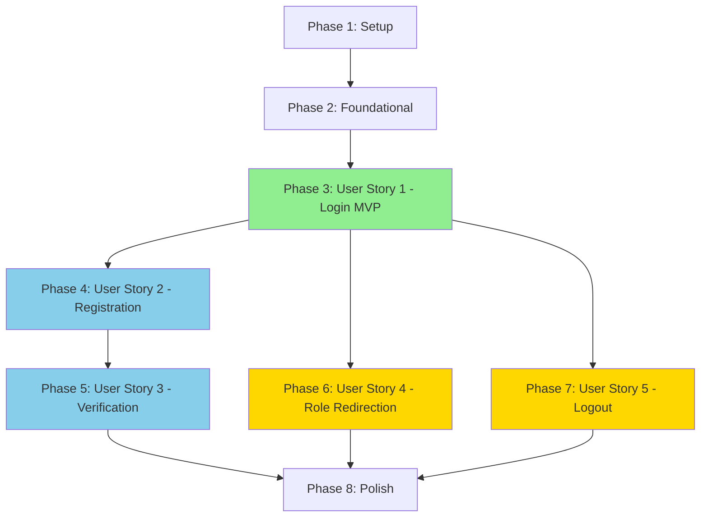

# Tasks: Authentication System - Login & Registration

**Feature**: 001-auth-login-registration  
**Generated**: 2026-03-05  
**Spec**: [spec.md](./spec.md) | **Plan**: [plan.md](./plan.md)

---

## Implementation Strategy

This feature follows an **incremental delivery approach** where each user story represents an independently testable slice of functionality:

- **Phase 1**: Setup - Project initialization and foundational infrastructure
- **Phase 2**: Foundational - Blocking prerequisites for all user stories
- **Phase 3**: User Story 1 (P1) - Employee Login - The MVP that delivers immediate value
- **Phase 4**: User Story 2 (P2) - Admin-Driven Registration - User onboarding capability
- **Phase 5**: User Story 3 (P2) - Slack Verification - Account activation
- **Phase 6**: User Story 4 (P3) - Role-Based Redirection - Enhanced UX
- **Phase 7**: User Story 5 (P3) - Logout Functionality - Session security
- **Phase 8**: Polish - Cross-cutting concerns and cleanup

**Recommended MVP**: Complete through Phase 3 (User Story 1) for a working login system.

---

## Phase 1: Setup

**Goal**: Initialize project infrastructure and dependencies

- [X] T001 Install and configure Laravel Fortify in config/fortify.php
- [X] T002 [P] Install Spatie Laravel Permission package via composer
- [X] T003 [P] Publish Spatie migrations and run to create roles/permissions tables
- [X] T004 [P] Configure Slack API credentials in config/services.php
- [X] T005 [P] Set up database session driver in config/session.php
- [X] T006 [P] Create verification_tokens table migration in database/migrations/
- [X] T007 [P] Remove legacy role_id/secondary_role_id columns from users table (if exist)
- [X] T008 Run migrations to set up database schema
- [X] T009 Seed roles table with 4 roles using Spatie (employee, hr, team-lead, project-manager)

---

## Phase 2: Foundational (Blocking Prerequisites)

**Goal**: Build shared infrastructure needed by all user stories

**Independent Test**: Middleware correctly blocks unauthenticated users from protected routes

### Models & Core Services

- [X] T010 [P] Create VerificationToken model in app/Models/VerificationToken.php
- [X] T011 [P] Update User model to use Spatie HasRoles trait in app/Models/User.php
- [X] T012 Create SlackService with environment-aware behavior in app/Services/SlackService.php
- [X] T013 Write unit tests for SlackService in tests/Unit/Services/SlackServiceTest.php

### Middleware & Authentication

- [X] T014 [P] Create EnsureUserIsActive middleware in app/Http/Middleware/EnsureUserIsActive.php
- [X] T015 [P] Use Spatie's built-in role middleware (configured in bootstrap/app.php)
- [X] T016 [P] Create RedirectIfAuthenticated middleware in app/Http/Middleware/RedirectIfAuthenticated.php
- [X] T017 Configure Fortify authentication logic in app/Providers/FortifyServiceProvider.php
- [X] T018 Register middleware in bootstrap/app.php

---

## Phase 3: User Story 1 - Employee Login (P1) ⭐ MVP

**Goal**: Users can log in with email/password and be redirected based on their role

**Independent Test**: Create a test user, log in with valid credentials, verify redirect to correct dashboard (/leaves for employees, /portal for approvers)

**Acceptance Criteria**:
- ✅ Active, verified users can log in successfully
- ✅ Unverified or inactive users cannot log in
- ✅ Employees redirect to /leaves
- ✅ Approvers redirect to /portal
- ✅ Already authenticated users redirect away from login page

### UI Components

- [X] T019 [US1] Create Login Livewire component in app/Livewire/Auth/Login.php
- [X] T020 [US1] Create login Blade view with Flux UI components in resources/views/livewire/auth/login.blade.php
- [X] T021 [US1] Add FDC logo display to login page using public/images/fdc.png

### Authentication Logic

- [X] T022 [US1] Configure Fortify to check status=1 AND verified_at in app/Providers/FortifyServiceProvider.php
- [X] T023 [US1] Implement role-based redirect logic using Spatie's hasRole() in app/Providers/FortifyServiceProvider.php
- [X] T024 [US1] Add RedirectIfAuthenticated middleware to login route in routes/web.php

### Routes

- [X] T025 [US1] Define login routes in routes/web.php

### Tests

- [X] T026 [US1] Write feature test for successful employee login in tests/Feature/Auth/LoginTest.php
- [X] T027 [US1] Write feature test for successful approver login (hr/team-lead/project-manager) in tests/Feature/Auth/LoginTest.php
- [X] T028 [US1] Write feature test for unverified user login rejection in tests/Feature/Auth/LoginTest.php
- [X] T029 [US1] Write feature test for inactive user login rejection in tests/Feature/Auth/LoginTest.php
- [X] T030 [US1] Write feature test for invalid credentials in tests/Feature/Auth/LoginTest.php
- [X] T031 [US1] Write feature test for authenticated user redirect from login page in tests/Feature/Auth/LoginTest.php

---

## Phase 4: User Story 2 - Admin-Driven Registration (P2)

**Goal**: HR administrators can register new users with Slack validation

**Independent Test**: Log in as HR admin, register a new user with valid Slack ID, verify user created with for_verification status and Slack channel invitation sent

**Acceptance Criteria**:
- ✅ Only HR admins can access registration
- ✅ Slack ID validated in real-time (production/staging)
- ✅ Email and Slack ID uniqueness enforced
- ✅ User created with status=2 (for_verification)
- ✅ Verification DM sent via Slack
- ✅ User added to Slack channel

### Actions & Business Logic

- [X] T032 [US2] Create RegisterUserAction with Spatie role assignment in app/Actions/Auth/RegisterUserAction.php
- [X] T033 [US2] Write unit tests for RegisterUserAction in tests/Unit/Actions/Auth/RegisterUserActionTest.php

### Form Requests

- [X] T034 [US2] Create RegisterUserRequest with validation rules in app/Http/Requests/Auth/RegisterUserRequest.php

### UI Components

- [X] T035 [US2] Create Register Livewire component in app/Livewire/Auth/Register.php
- [X] T036 [US2] Create registration Blade view with Flux UI form in resources/views/livewire/auth/register.blade.php
- [X] T037 [US2] Add real-time Slack ID validation to registration form in app/Livewire/Auth/Register.php
- [X] T038 [US2] Add loading indicators for Slack API calls in resources/views/livewire/auth/register.blade.php

### Slack Integration

- [X] T039 [P] [US2] Implement validateSlackId method in SlackService in app/Services/SlackService.php
- [X] T040 [P] [US2] Implement addToChannel method in SlackService in app/Services/SlackService.php
- [X] T041 [US2] Create SendSlackVerificationJob in app/Jobs/SendSlackVerificationJob.php
- [X] T042 [US2] Create AddUserToSlackChannelJob in app/Jobs/AddUserToSlackChannelJob.php

### Routes

- [X] T043 [US2] Define registration routes with Spatie 'role:hr' middleware in routes/web.php

### Tests

- [X] T044 [US2] Write feature test for successful registration in tests/Feature/Auth/RegistrationTest.php
- [X] T045 [US2] Write feature test for duplicate email rejection in tests/Feature/Auth/RegistrationTest.php
- [X] T046 [US2] Write feature test for duplicate Slack ID rejection in tests/Feature/Auth/RegistrationTest.php
- [X] T047 [US2] Write feature test for invalid Slack ID rejection in tests/Feature/Auth/RegistrationTest.php
- [X] T048 [US2] Write feature test for Slack API unavailable error in tests/Feature/Auth/RegistrationTest.php
- [X] T049 [US2] Write feature test for local environment bypass in tests/Feature/Auth/RegistrationTest.php
- [X] T050 [US2] Write feature test for non-HR user blocked from registration in tests/Feature/Auth/RegistrationTest.php

---

## Phase 5: User Story 3 - Slack Verification (P2)

**Goal**: Users can verify their account via Slack DM link

**Independent Test**: Register a user, click verification link, verify account status changes to active and user can log in

**Acceptance Criteria**:
- ✅ Verification link sent via Slack DM
- ✅ Valid token activates account (status → 1, verified_at set)
- ✅ Expired/invalid tokens show error
- ✅ Already verified accounts handled gracefully
- ✅ Verified users can log in

### Actions & Business Logic

- [X] T051 [US3] Create VerifyAccountAction in app/Actions/Auth/VerifyAccountAction.php
- [X] T052 [US3] Write unit tests for VerifyAccountAction in tests/Unit/Actions/Auth/VerifyAccountActionTest.php

### Controllers

- [X] T053 [US3] Create VerificationController for token handling in app/Http/Controllers/Auth/VerificationController.php

### UI Components

- [X] T054 [US3] Create RequestNewVerification Livewire component in app/Livewire/Auth/RequestNewVerification.php
- [X] T055 [US3] Create verification result Blade view in resources/views/auth/verification-result.blade.php
- [X] T056 [US3] Create request new verification Blade view in resources/views/livewire/auth/request-new-verification.blade.php

### Slack Integration

- [X] T057 [US3] Implement sendVerificationDM method in SlackService in app/Services/SlackService.php

### Routes

- [X] T058 [US3] Define verification routes in routes/web.php

### Tests

- [X] T059 [US3] Write feature test for successful verification in tests/Feature/Auth/VerificationTest.php
- [X] T060 [US3] Write feature test for expired token handling in tests/Feature/Auth/VerificationTest.php
- [X] T061 [US3] Write feature test for invalid token handling in tests/Feature/Auth/VerificationTest.php
- [X] T062 [US3] Write feature test for already verified account in tests/Feature/Auth/VerificationTest.php
- [X] T063 [US3] Write feature test for requesting new verification link in tests/Feature/Auth/VerificationTest.php
- [X] T064 [US3] Write feature test for verified user can login in tests/Feature/Auth/VerificationTest.php

---

## Phase 6: User Story 4 - Role-Based Redirection (P3)

**Goal**: Users automatically redirect to appropriate dashboard based on role

**Independent Test**: Log in with each role type (employee, hr, team-lead, project-manager) and verify correct redirection; test multi-role access

**Acceptance Criteria**:
- ✅ Employee role → /leaves
- ✅ Approver roles (hr|team-lead|project-manager) → /portal
- ✅ Multi-role users grant access to all role capabilities
- ✅ Spatie role middleware enforces role-based access

### Tests

- [X] T065 [US4] Write feature test for employee role redirection to /leaves in tests/Feature/Auth/RoleRedirectionTest.php
- [X] T066 [US4] Write feature test for hr role redirection to /portal in tests/Feature/Auth/RoleRedirectionTest.php
- [X] T067 [US4] Write feature test for team-lead role redirection to /portal in tests/Feature/Auth/RoleRedirectionTest.php
- [X] T068 [US4] Write feature test for project-manager role redirection to /portal in tests/Feature/Auth/RoleRedirectionTest.php
- [X] T069 [US4] Write feature test for multi-role user access in tests/Feature/Auth/RoleRedirectionTest.php
- [X] T070 [US4] Write feature test for unauthorized role access blocked in tests/Feature/Auth/RoleRedirectionTest.php

### Integration

- [X] T071 [US4] Apply Spatie 'role:employee' middleware to /leaves route in routes/web.php
- [X] T072 [US4] Apply Spatie 'role:hr|team-lead|project-manager' middleware to /portal route in routes/web.php
- [X] T073 [US4] Create placeholder /leaves page for employees in resources/views/pages/leaves.blade.php
- [X] T074 [US4] Create placeholder /portal page for approvers in resources/views/pages/portal.blade.php

---

## Phase 7: User Story 5 - Logout Functionality (P3)

**Goal**: Users can securely log out and sessions are properly terminated

**Independent Test**: Log in, log out, verify session destroyed and protected pages redirect to login

**Acceptance Criteria**:
- ✅ Logout button terminates session
- ✅ Post-logout access to protected pages redirects to login
- ✅ Browser back button cannot access logged-out session
- ✅ Deactivated user sessions invalidated at next request

### UI Components

- [X] T075 [US5] Add logout button to main layout in resources/views/layouts/app.blade.php

### Actions & Business Logic

- [X] T076 [US5] Create InvalidateDeactivatedSessionAction in app/Actions/Auth/InvalidateDeactivatedSessionAction.php
- [X] T077 [US5] Integrate session invalidation check in EnsureUserIsActive middleware in app/Http/Middleware/EnsureUserIsActive.php

### Tests

- [X] T078 [US5] Write feature test for successful logout in tests/Feature/Auth/LogoutTest.php
- [X] T079 [US5] Write feature test for post-logout page access blocked in tests/Feature/Auth/LogoutTest.php
- [X] T080 [US5] Write feature test for browser back button blocked in tests/Feature/Auth/LogoutTest.php
- [X] T081 [US5] Write feature test for deactivated user auto-logout in tests/Feature/Auth/LogoutTest.php
- [X] T082 [US5] Write feature test for multi-session support in tests/Feature/Auth/MultiSessionTest.php

---

## Phase 8: Polish & Cross-Cutting Concerns

**Goal**: Complete remaining infrastructure and cleanup tasks

### Token Cleanup

- [X] T083 Create CleanupExpiredTokensJob in app/Jobs/CleanupExpiredTokensJob.php
- [X] T084 Schedule daily token cleanup in routes/console.php
- [X] T085 Write test for token cleanup job in tests/Unit/Jobs/CleanupExpiredTokensJobTest.php

### Factories

- [X] T086 [P] Create VerificationTokenFactory in database/factories/VerificationTokenFactory.php
- [X] T087 [P] Update UserFactory to support all statuses in database/factories/UserFactory.php

### Documentation

- [X] T088 [P] Add authentication setup to README.md
- [X] T089 [P] Document Slack API configuration in README.md
- [X] T090 [P] Document environment-specific behavior in README.md

### Code Quality

- [X] T091 Run Laravel Pint to format all PHP files
- [X] T092 Verify all tests pass with minimum 80% coverage
- [X] T093 Review and fix any remaining PHPStan/static analysis issues

---

## Dependency Graph

**Legend**:
- 🟢 Green (US1): MVP - Critical path
- 🔵 Blue (US2-3): High priority - Core features
- 🟡 Yellow (US4-5): Medium priority - Enhanced UX

---

## Parallel Execution Opportunities

### Phase 1 (Setup)
- **Parallel Group A**: T002 (Spatie), T004 (Slack config), T005 (Session config), T006 (Verification migration)
- **Note**: T007 removes legacy role_id columns, T009 seeds Spatie roles

### Phase 2 (Foundational)
- **Parallel Group A**: T010 (VerificationToken), T011 (User with HasRoles trait)
- **Parallel Group B**: T014, T016 (different middleware files)
- **Note**: T015 uses Spatie's built-in role middleware (no custom file)

### Phase 3 (User Story 1)
- **Parallel Group A**: T019, T020 (component + view after prerequisites)
- **Parallel Group B**: T026, T027, T028, T029, T030, T031 (all test files)

### Phase 4 (User Story 2)
- **Parallel Group A**: T039, T040, T041, T042 (Slack integration tasks)
- **Parallel Group B**: T044-T050 (all test files)

### Phase 5 (User Story 3)
- **Parallel Group A**: T054, T055, T056 (UI component files)
- **Parallel Group B**: T059-T064 (all test files)

### Phase 6 (User Story 4)
- **Parallel Group A**: T065-T070 (all test files)
- **Parallel Group B**: T073, T074 (placeholder views)

### Phase 7 (User Story 5)
- **Parallel Group A**: T078-T082 (all test files)

### Phase 8 (Polish)
- **Parallel Group A**: T086, T087 (factory files)
- **Parallel Group B**: T088, T089, T090 (documentation files)

---

## Task Statistics

- **Total Tasks**: 93
- **Setup Phase**: 8 tasks
- **Foundational Phase**: 10 tasks
- **User Story 1 (P1 - MVP)**: 13 tasks
- **User Story 2 (P2)**: 19 tasks
- **User Story 3 (P2)**: 14 tasks
- **User Story 4 (P3)**: 10 tasks
- **User Story 5 (P3)**: 8 tasks
- **Polish Phase**: 11 tasks
- **Parallelizable Tasks**: ~45 tasks (48%)

---

## MVP Recommendation

**Minimum Viable Product**: Complete through **Phase 3 (User Story 1)**

This delivers:
- ✅ Working login system
- ✅ Role-based redirection
- ✅ Session management
- ✅ Middleware protection
- ✅ ~31 tasks (Setup + Foundational + US1)

**Why stop here**: 
- Independently testable and demonstrable
- Provides immediate value (users can access system)
- Registration can be done manually via database/tinker for initial testing
- Verification can be added in next iteration

**Next increment**: Add User Story 2 + 3 (Registration + Verification) for complete onboarding flow.

---

## Validation Checklist

- [x] All tasks follow checklist format with checkbox, ID, optional [P] and [Story] labels
- [x] Each task includes specific file path
- [x] Tasks organized by user story (independently testable phases)
- [x] Setup and Foundational phases clearly separated
- [x] MVP clearly identified (Phase 3)
- [x] Parallel execution opportunities documented
- [x] Dependency graph shows user story completion order
- [x] Task statistics provided
- [x] Each phase has clear goal and acceptance criteria

---

**Generated**: 2026-03-05 | **Total Tasks**: 93 | **MVP**: 31 tasks | **Format**: ✅ Valid
