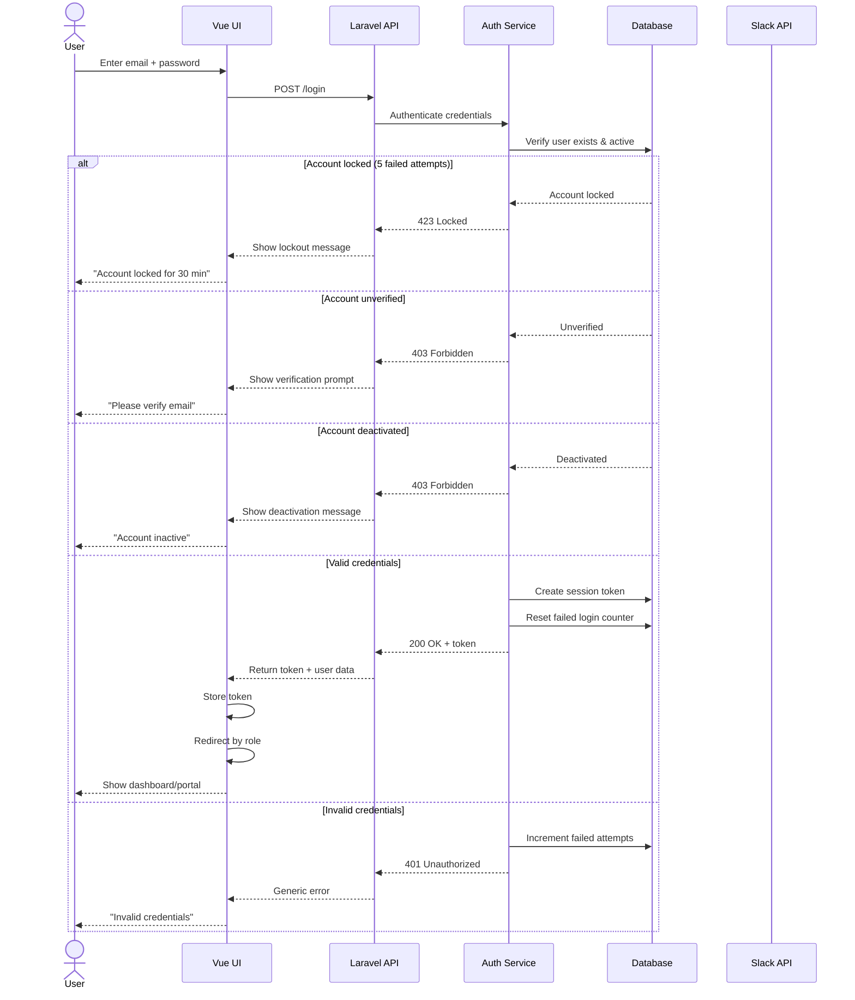
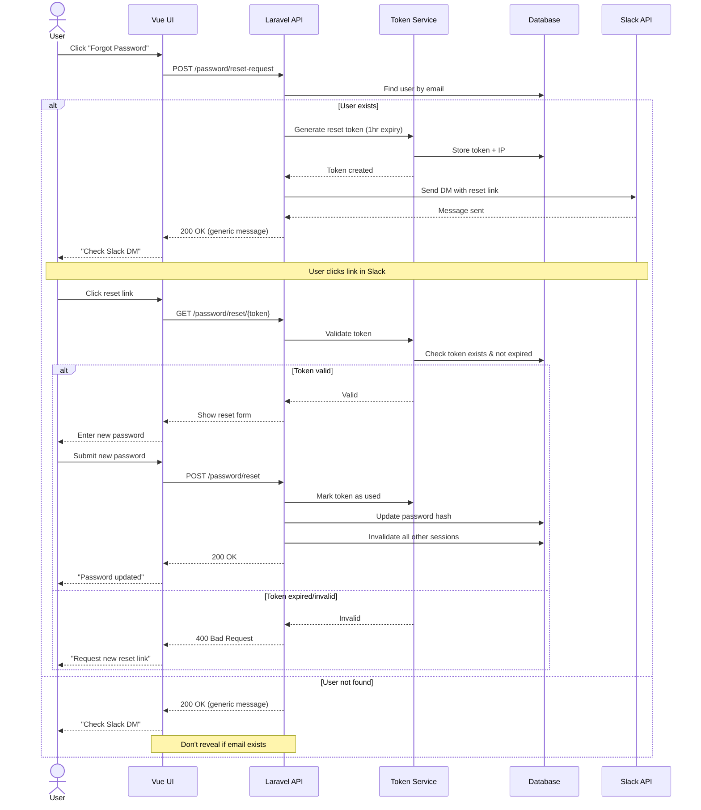
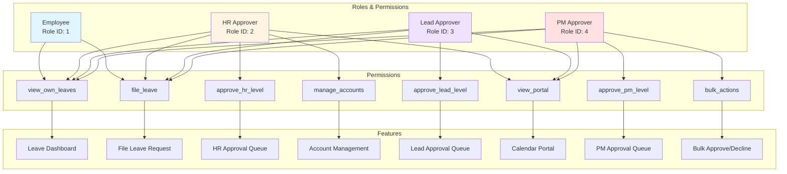
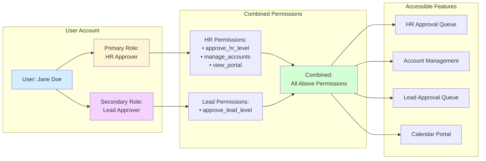
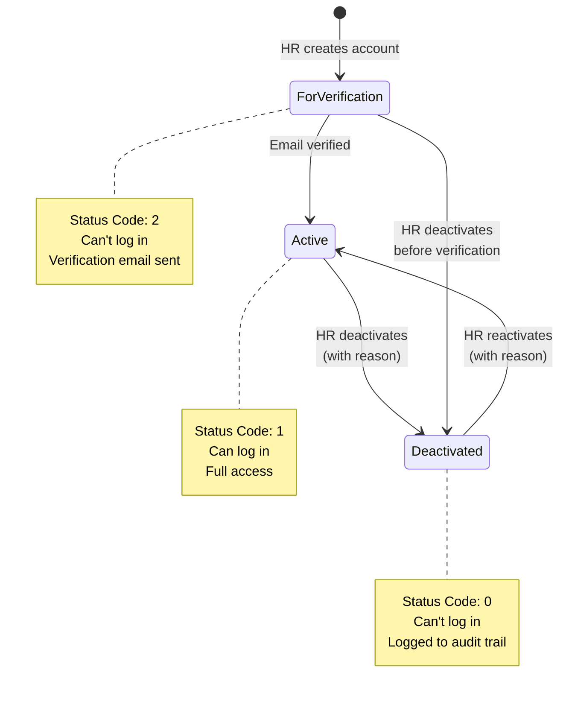
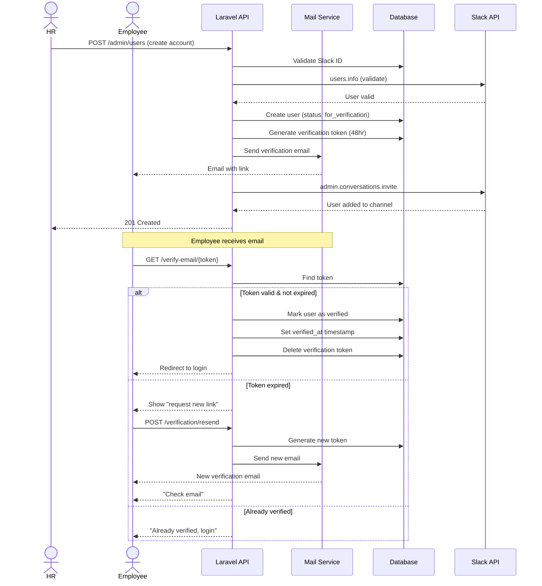
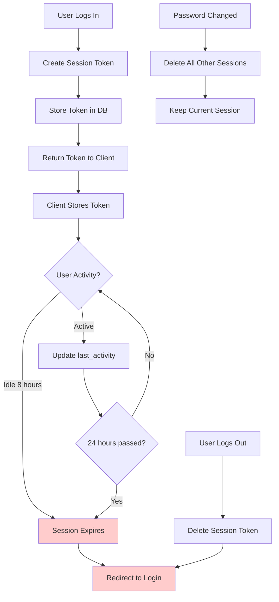
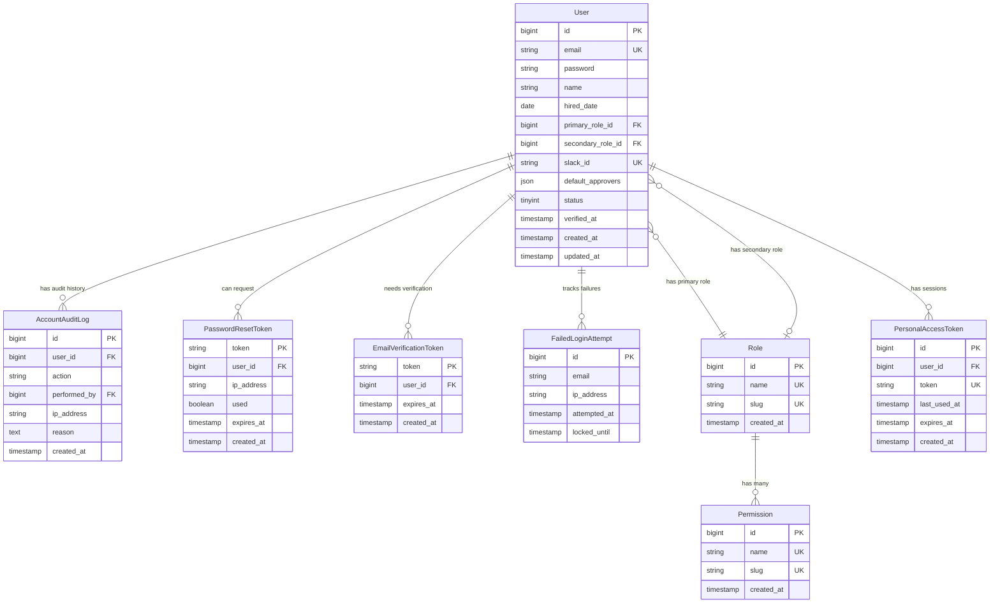

# Architecture Diagrams: Authentication & Registration System

**Feature**: 001-auth-revamp  
**Created**: 2026-03-04

## Authentication Flow

## Password Reset Flow

## Role-Based Access Control

## Multi-Role Support

## Account Management Flow

## Email Verification Flow

## Session Management

## Data Model Entity Relationships

