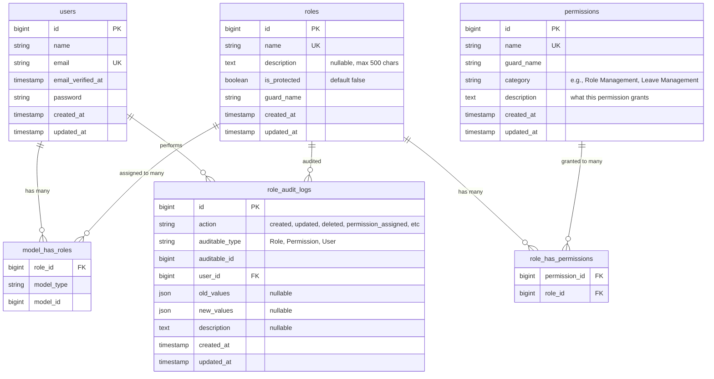
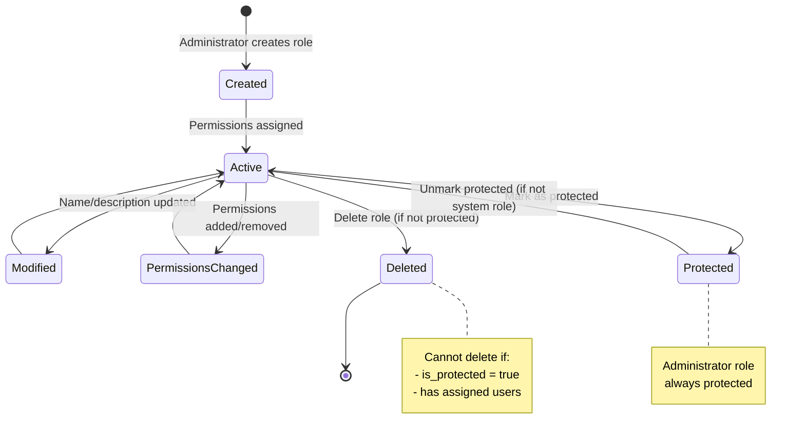
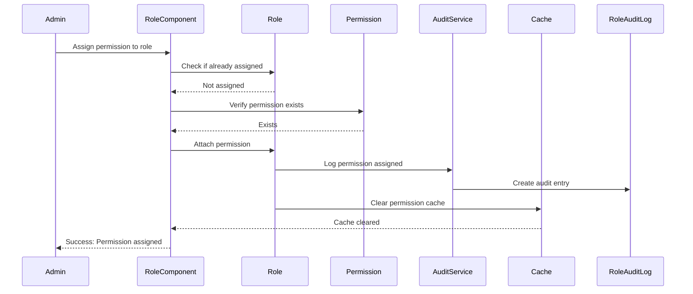

# Data Model: Role & Permission Management

**Feature**: 002-role-permission-management  
**Date**: March 6, 2026  
**Status**: Design Complete

## Entity Relationship Diagram



## Entities

### User (Existing)
**Purpose**: System users who can be assigned roles

**Attributes**:
- `id` (bigint, PK): Unique identifier
- `name` (string): User's full name
- `email` (string, unique): User's email address
- `email_verified_at` (timestamp, nullable): Email verification timestamp
- `password` (string): Hashed password
- `created_at` (timestamp): Record creation time
- `updated_at` (timestamp): Last modification time

**Relationships**:
- Has many roles (many-to-many through `model_has_roles`)
- Has many audit logs (one-to-many)

**Business Rules**:
- Can have multiple roles
- Inherits combined permissions from all assigned roles
- Must have valid email address
- At least one user must have Administrator role at all times

### Role (Extended)
**Purpose**: Named collection of permissions that can be assigned to users

**Attributes**:
- `id` (bigint, PK): Unique identifier
- `name` (string, unique): Role name (max 50 chars, alphanumeric + space/hyphen/underscore)
- `description` (text, nullable): Optional role description (max 500 chars)
- `is_protected` (boolean): Flag for system-protected roles (default: false)
- `guard_name` (string): Guard context (typically 'web')
- `created_at` (timestamp): Record creation time
- `updated_at` (timestamp): Last modification time

**Relationships**:
- Has many permissions (many-to-many through `role_has_permissions`)
- Belongs to many users (many-to-many through `model_has_roles`)
- Has many audit logs (polymorphic one-to-many)

**Business Rules**:
- Name must be unique per guard
- Name must match pattern: `/^[a-zA-Z0-9\s\-_]+$/`
- Name required, max 50 characters
- Description optional, max 500 characters
- Protected roles (`is_protected = true`) cannot be deleted
- Administrator role is always protected
- Cannot delete role if it has assigned users (must warn and reassign)

**Indexes**:
- Primary key on `id`
- Unique compound index on (`name`, `guard_name`)
- Index on `is_protected` for filtering

### Permission (Extended)
**Purpose**: Specific capability or action within the system

**Attributes**:
- `id` (bigint, PK): Unique identifier
- `name` (string, unique): Permission identifier (e.g., 'approve_leave_requests')
- `guard_name` (string): Guard context (typically 'web')
- `category` (string): Functional grouping (e.g., 'Leave Management', 'Role Management')
- `description` (text): Human-readable explanation of what this permission grants
- `created_at` (timestamp): Record creation time
- `updated_at` (timestamp): Last modification time

**Relationships**:
- Belongs to many roles (many-to-many through `role_has_permissions`)
- Has many audit logs (polymorphic one-to-many)

**Business Rules**:
- Name must be unique per guard
- Permissions are system-defined (seeded), not created by administrators
- Description must clearly explain the permission's purpose
- Category helps organize permissions in UI
- Cannot be deleted (only soft-deprecated if needed in future)

**Indexes**:
- Primary key on `id`
- Unique compound index on (`name`, `guard_name`) (provided by spatie)
- Index on `category` for filtering

### RoleAuditLog (New)
**Purpose**: Immutable audit trail of all role and permission changes

**Attributes**:
- `id` (bigint, PK): Unique identifier
- `action` (string): Type of action performed (created, updated, deleted, permission_assigned, permission_removed, user_assigned, user_removed)
- `auditable_type` (string): Type of entity being audited (Role, Permission, User)
- `auditable_id` (bigint): ID of the audited entity
- `user_id` (bigint, FK): ID of user who performed the action
- `old_values` (json, nullable): Previous state before change
- `new_values` (json, nullable): New state after change
- `description` (text, nullable): Human-readable description of the change
- `created_at` (timestamp): When action occurred
- `updated_at` (timestamp): Not used (audit logs are immutable)

**Relationships**:
- Belongs to User (one-to-many)
- Belongs to auditable entity (polymorphic many-to-one)

**Business Rules**:
- Records are immutable (no updates or deletes)
- Every role/permission change must create an audit log
- Audit logs must be retained for minimum 7 years (per constitution)
- User who performed action must be recorded
- Description should be human-readable for audit reports

**Indexes**:
- Primary key on `id`
- Compound index on (`auditable_type`, `auditable_id`) for entity lookups
- Index on `created_at` for chronological queries
- Index on `user_id` for user activity reports

## Many-to-Many Relationships

### model_has_roles (Spatie Table)
**Purpose**: Associates users with roles

**Attributes**:
- `role_id` (bigint, FK): References roles.id
- `model_type` (string): Polymorphic type (typically 'App\Models\User')
- `model_id` (bigint): User ID

**Composite Keys**:
- Primary key on (`role_id`, `model_id`, `model_type`)
- Foreign key to `roles(id)` with cascade delete

**Business Rules**:
- User can have multiple roles
- Same role cannot be assigned to user twice
- Removing role immediately revokes associated permissions

### role_has_permissions (Spatie Table)
**Purpose**: Associates permissions with roles

**Attributes**:
- `permission_id` (bigint, FK): References permissions.id
- `role_id` (bigint, FK): References roles.id

**Composite Keys**:
- Primary key on (`permission_id`, `role_id`)
- Foreign keys with cascade delete

**Business Rules**:
- Role can have multiple permissions
- Permission can belong to multiple roles
- Same permission cannot be assigned to role twice
- Changes to role permissions affect all users with that role

## State Transitions

### Role Lifecycle



### Permission Assignment Flow



## Validation Rules

### Role
```php
[
    'name' => ['required', 'string', 'max:50', 'regex:/^[a-zA-Z0-9\s\-_]+$/', 'unique:roles,name'],
    'description' => ['nullable', 'string', 'max:500'],
    'is_protected' => ['sometimes', 'boolean'],
]
```

### Permission Assignment
```php
[
    'role_id' => ['required', 'exists:roles,id'],
    'permission_ids' => ['required', 'array', 'min:1'],
    'permission_ids.*' => ['exists:permissions,id'],
]
```

### User Role Assignment
```php
[
    'user_id' => ['required', 'exists:users,id'],
    'role_ids' => ['required', 'array', 'min:1'],
    'role_ids.*' => ['exists:roles,id'],
]
```

## Data Integrity Constraints

1. **Referential Integrity**:
   - Foreign keys enforce valid references
   - Cascade deletes clean up junction tables
   - Cannot delete role with assigned users (application-level check)

2. **Uniqueness**:
   - Role name unique per guard
   - Permission name unique per guard
   - User email unique globally

3. **Required Fields**:
   - Role: name, guard_name
   - Permission: name, guard_name, category, description
   - RoleAuditLog: action, auditable_type, auditable_id, user_id

4. **Business Constraints**:
   - At least one Administrator role must exist
   - At least one user must have Administrator role
   - Protected roles cannot be deleted
   - Audit logs cannot be modified or deleted

## Migration Sequence

1. ✅ **Existing**: Spatie migrations (roles, permissions, model_has_roles, model_has_permissions, role_has_permissions)
2. **New**: `YYYY_MM_DD_add_columns_to_permissions_table` - Add category, description
3. **New**: `YYYY_MM_DD_add_columns_to_roles_table` - Add description, is_protected
4. **New**: `YYYY_MM_DD_create_role_audit_logs_table` - Create audit trail
5. **Seeder**: `PermissionSeeder` - Seed all system permissions
6. **Seeder**: `RoleSeeder` - Create Administrator role with all permissions

## Query Patterns

### Get all roles with permission counts
```php
Role::withCount('permissions')
    ->with('permissions:id,name,category')
    ->get();
```

### Get users by role
```php
User::role('Team Lead')->get();
```

### Get role audit history
```php
RoleAuditLog::where('auditable_type', Role::class)
    ->where('auditable_id', $roleId)
    ->with('user:id,name')
    ->latest()
    ->paginate(50);
```

### Check if user can perform action
```php
auth()->user()->can('approve_leave_requests');
auth()->user()->hasRole('Administrator');
```

### Get permissions by category
```php
Permission::where('category', 'Leave Management')
    ->orderBy('name')
    ->get();
```

## Performance Considerations

1. **Permission Caching**: Spatie automatically caches permissions; clear cache after changes
2. **Eager Loading**: Always load relationships to prevent N+1 queries
3. **Pagination**: Audit logs and role lists should always be paginated
4. **Indexes**: Proper indexes on foreign keys and frequently queried columns
5. **Query Optimization**: Use `withCount()` instead of loading full relationships when only counts needed

## Future Extensibility

**Potential Enhancements** (not in current scope):
- Role hierarchies (roles inherit from parent roles)
- Time-based role assignments (temporary elevated access)
- IP-based restrictions (role only valid from certain IPs)
- Department-specific permissions
- Custom permission attributes (metadata)

These are NOT part of current implementation but data model can accommodate them with minimal changes.