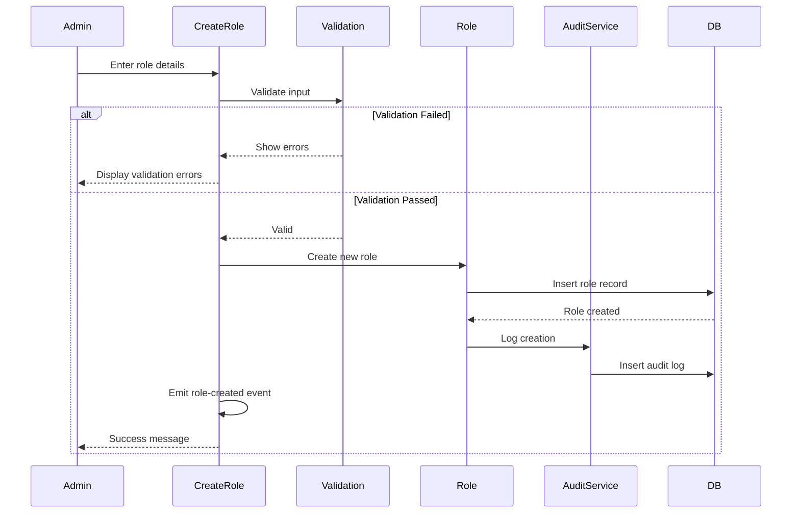
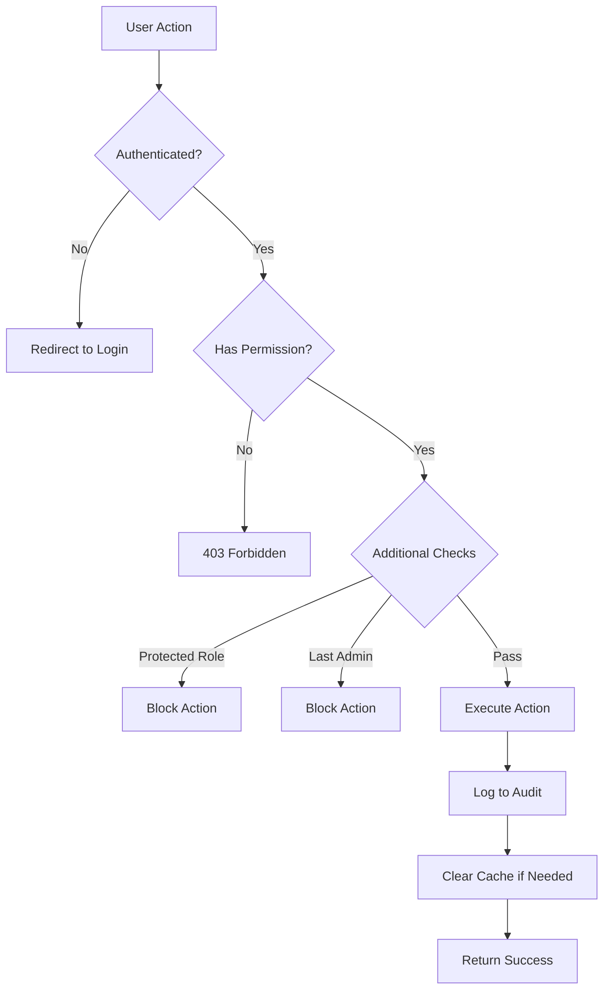
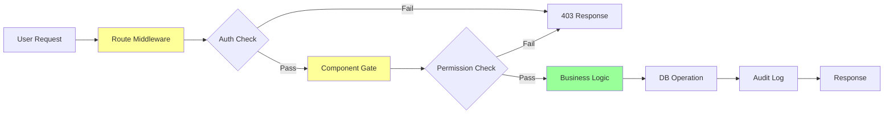

# Implementation Plan: Role & Permission Management

**Branch**: `002-role-permission-management` | **Date**: March 6, 2026 | **Spec**: [spec.md](./spec.md)
**Input**: Feature specification from `/specs/002-role-permission-management/spec.md`

## Summary

Implement role-based access control (RBAC) system allowing administrators to create roles, assign system-defined permissions to roles, and assign roles to users. Uses existing spatie/laravel-permission package with custom extensions for role descriptions, audit logging, and protected role management. System permissions are predefined/seeded by developers; administrators can only view and assign them. All role management activities are logged to an immutable audit trail.

## Technical Context

**Language/Version**: PHP 8.3.30  
**Framework**: Laravel 12  
**Primary Dependencies**: 
- spatie/laravel-permission ^7.2 (already installed)
- livewire/livewire ^4.0 (already installed)
- livewire/flux ^2.9.0 (already installed)

**Storage**: MySQL/PostgreSQL (via Laravel's database abstraction)  
**Testing**: PHPUnit 11.5, Laravel Dusk (for browser tests)  
**Target Platform**: Web application (browser-based)  
**Project Type**: Web service / admin panel  
**Performance Goals**: 
- < 200ms response time for role list operations
- < 300ms for CRUD operations
- < 500ms for permission assignment (includes cache clear)
- Support 50 custom roles, 100 permissions, 1000+ users

**Constraints**: 
- Test-first development (TDD) mandatory per constitution
- Permission checks required at UI and API layers
- Audit trail required for all changes
- Zero-downtime deployment
- Backward compatible migrations

**Scale/Scope**: 
- 6 user stories (4 P1, 1 P2, 1 P3)
- 6 Livewire components
- 1 service class (audit)
- 3 new migrations
- 2 seeders
- ~20 feature tests minimum

## Constitution Check

*GATE: Must pass before Phase 0 research. Re-check after Phase 1 design.*

### ✅ III. Permission-Based Access Control
**Status**: COMPLIANT  
**Verification**: 
- Role management routes protected by `role:Administrator` middleware
- Permission checks at component level using Gates
- UI elements hidden with `@can` directives
- Follows principle of least privilege (specific permissions for each action)

### ✅ II. Data Consistency & Audit Trail
**Status**: COMPLIANT  
**Verification**:
- Custom `RoleAuditService` logs all role/permission changes
- Audit logs record: Who (user_id), What (action), When (timestamp), Why (description)
- Audit logs immutable (no updates/deletes)
- Stores old_values and new_values as JSON for change tracking

### ✅ V. Test-First Development (NON-NEGOTIABLE)
**Status**: COMPLIANT  
**Verification**:
- TDD workflow documented in quickstart.md
- Feature tests required for all role CRUD operations
- Unit tests for RoleAuditService
- Test coverage minimum 80% per constitution
- Tests written → User approved → Tests fail → Implementation → Tests pass

### ✅ VI. Visual Documentation (MANDATORY)
**Status**: COMPLIANT  
**Verification**:
- ERD diagram in data-model.md showing all entities and relationships
- State transition diagram for role lifecycle  
- Sequence diagram for permission assignment flow
- All diagrams use Mermaid format

### ✅ VII. Date & Time Handling Standards
**Status**: NOT APPLICABLE  
**Reason**: This feature does not handle date ranges or durations (only audit timestamps which are automatic)

### ⚠️ Development Workflow - Environment & Execution Context
**Status**: REQUIRES VERIFICATION  
**Action Required**: Before implementation, must check `.env` file for Docker configuration  
**Note**: Implementation commands must be executed in correct context (container vs host)

### Summary
**Overall Status**: ✅ READY TO PROCEED  
**Blockers**: None  
**Action Items**: 
1. Verify .env configuration before running migrations/seeders
2. Ensure spatie package already configured (verified in research phase)
3. Confirm test environment set up

## Project Structure

### Documentation (this feature)

```text
specs/002-role-permission-management/
├── plan.md              # This file
├── spec.md              # Feature specification  
├── research.md          # Phase 0 research findings
├── data-model.md        # Phase 1 ERD and entity documentation
├── quickstart.md        # Phase 1 developer guide
├── contracts/           # Phase 1 interface contracts
│   └── interfaces.md    # Component and service contracts
├── checklists/
│   └── requirements.md  # Specification quality checklist
└── tasks.md             # Phase 2 (created by /speckit.tasks - NOT YET CREATED)
```

### Source Code (repository root)

```text
# Laravel 12 Application Structure (Extended)

app/
├── Http/
│   ├── Livewire/
│   │   ├── Roles/
│   │   │   ├── ManageRoles.php      # Main role management component
│   │   │   ├── CreateRole.php       # Create role modal/form
│   │   │   ├── EditRole.php         # Edit role + assign permissions
│   │   │   ├── AssignRoles.php      # Assign roles to users
│   │   │   ├── ViewPermissions.php  # Display system permissions
│   │   │   └── ViewAuditLogs.php    # Audit trail viewer
│   ├── Requests/
│   │   ├── StoreRoleRequest.php     # Validation for creating roles
│   │   ├── UpdateRoleRequest.php    # Validation for updating roles
│   │   └── AssignPermissionsRequest.php # Validation for permission assignment
│   └── Middleware/                   # (existing middleware)
├── Models/
│   ├── User.php                      # (existing, has HasRoles trait)
│   └── RoleAuditLog.php              # NEW: Audit log model
├── Services/
│   └── RoleAuditService.php          # NEW: Centralized audit logging
└── Providers/                        # (existing providers)

database/
├── factories/
│   └── RoleAuditLogFactory.php       # NEW: Factory for testing
├── migrations/
│   ├── YYYY_MM_DD_add_columns_to_permissions_table.php  # NEW
│   ├── YYYY_MM_DD_add_columns_to_roles_table.php        # NEW
│   └── YYYY_MM_DD_create_role_audit_logs_table.php      # NEW
└── seeders/
    ├── PermissionSeeder.php          # NEW: Seed all system permissions
    └── RoleSeeder.php                # NEW: Create Administrator role

resources/
└── views/
    └── livewire/
        └── roles/                     # NEW directory
            ├── manage-roles.blade.php
            ├── create-role.blade.php
            ├── edit-role.blade.php
            ├── assign-roles.blade.php
            ├── view-permissions.blade.php
            └── view-audit-logs.blade.php

routes/
└── web.php                           # Add role management routes

tests/
├── Feature/
│   ├── RoleManagementTest.php        # NEW: Role CRUD tests
│   ├── PermissionAssignmentTest.php  # NEW: Permission tests
│   ├── RoleAssignmentTest.php        # NEW: User role tests
│   └── RoleAuditTest.php             # NEW: Audit logging tests
└── Unit/
    └── RoleAuditServiceTest.php      # NEW: Service unit tests

config/
└── permission.php                    # (existing spatie config)
```

**Structure Decision**: Laravel 12 web application structure using Livewire for interactive UI. Following existing project conventions:
- Livewire components in `app/Http/Livewire/Roles/` namespace
- Form requests for validation
- Services directory for business logic
- Standard Laravel test organization
- Spatie permission package provides Role and Permission models (no need to create custom models)

## Complexity Tracking

> **Fill ONLY if Constitution Check has violations that must be justified**

**Status**: No violations - no complexity tracking needed

All constitutional requirements are met without introducing unnecessary complexity. Using existing patterns and packages (spatie/laravel-permission, Livewire, Laravel testing framework).

---

## Implementation Sequence

### Phase 0: Research ✅ COMPLETE
- [x] Research spatie/laravel-permission v7.2 best practices
- [x] Determine permission seeding strategy
- [x] Design audit trail approach
- [x] Define validation patterns
- [x] Document permission checking layers
- [x] Output: [research.md](./research.md)

### Phase 1: Design ✅ COMPLETE
- [x] Create ERD with all entities and relationships
- [x] Define entity attributes and business rules
- [x] Document state transitions and workflows
- [x] Define component interfaces and contracts
- [x] Create developer quickstart guide
- [x] Output: [data-model.md](./data-model.md), [contracts/](./contracts/), [quickstart.md](./quickstart.md)

### Phase 2: Task Breakdown (Next Step)
Run `/speckit.tasks` to generate detailed implementation tasks from this plan.

---

## Implementation Phases (Post-Planning)

### Setup Phase (Est: 2 hours)
**Priority**: Foundation  
**Dependencies**: None

**Tasks**:
1. Create migrations for role/permission extensions
2. Create audit log migration
3. Create permission seeder with all system permissions
4. Create role seeder (Administrator role)
5. Run migrations and seeders
6. Verify spatie package configuration
7. Assign Administrator role to initial user

**Deliverables**:
- 3 migration files
- 2 seeder files
- Database seeded with permissions and Administrator role

**Tests**:
- Verify migrations run successfully
- Verify seeders populate correct data
- Verify role can be assigned to user

---

### Core CRUD (Priority: P1) (Est: 8 hours)
**Priority**: P1 - Foundation  
**Dependencies**: Setup Phase  
**User Stories**: Story 1, Story 3 (partial)

**Tasks**:
1. Create RoleAuditLog model and factory
2. Create RoleAuditService with logging methods
3. Create ManageRoles Livewire component
4. Create CreateRole Livewire component
5. Create StoreRoleRequest with validation
6. Create role management routes
7. Create Blade views for role listing and creation
8. Integrate audit logging in all role operations
9. Add permission middleware to routes

**Deliverables**:
- Functional role list view
- Create role functionality with validation
- Edit role functionality
- Delete role (with protection checks)
- Audit logging for all operations

**Tests** (TDD - Write First):
- Administrator can view roles list
- Administrator can create new role with valid name
- Role name validation (regex, length, uniqueness)
- Description validation (max 500 chars)
- Cannot create role without required fields
- Cannot create duplicate role name
- Can edit role name and description
- Cannot edit protected role name
- Can delete non-protected role without users
- Cannot delete protected role
- Cannot delete role with assigned users
- All operations create audit logs
- Non-administrator cannot access role management

---

### Permission Management (Priority: P1/P2) (Est: 6 hours)
**Priority**: P1/P2 - Core Feature  
**Dependencies**: Core CRUD  
**User Stories**: Story 2, Story 3

**Tasks**:
1. Create ViewPermissions Livewire component
2. Create EditRole component with permission assignment
3. Create AssignPermissionsRequest validation
4. Add permission checkboxes to edit role view
5. Implement permission sync functionality
6. Add permission cache clearing
7. Group permissions by category in UI
8. Add permission descriptions

**Deliverables**:
- View all system permissions grouped by category
- Assign multiple permissions to role
- Remove permissions from role
- Clear permission cache after changes
- Visual indication of assigned permissions

**Tests** (TDD - Write First):
- Can view all system permissions
- Permissions grouped by category
- Can assign permission to role
- Can assign multiple permissions at once
- Can remove permission from role
- Cannot assign non-existent permission
- Permission cache cleared after assignment
- Role users gain new permissions immediately (on next request)
- Audit logs created for permission changes
- Administrator role cannot have all permissions removed

---

### User-Role Assignment (Priority: P1) (Est: 5 hours)
**Priority**: P1 - Critical Feature  
**Dependencies**: Permission Management  
**User Stories**: Story 4

**Tasks**:
1. Create AssignRoles Livewire component
2. Integrate with user management (or standalone page)
3. Create role selection interface
4. Implement role sync functionality
5. Add multi-role support
6. Add last administrator check
7. Add visual role indicators

**Deliverables**:
- Assign one or more roles to user
- Remove roles from user
- View user's current roles
- Protection for last administrator
- Multi-role support (combined permissions)

**Tests** (TDD - Write First):
- Can assign role to user
- Can assign multiple roles to user
- Can remove role from user
- User gains permissions from assigned roles
- User has combined permissions from all roles
- Cannot remove Administrator role from last admin
- Cannot remove own Administrator role if sole admin
- Audit logs created for role assignments/removals
- Role changes take effect on next user request

---

### Safety Features & Usage (Priority: P2/P3) (Est: 4 hours)
**Priority**: P2/P3 - Polish  
**Dependencies**: User-Role Assignment  
**User Stories**: Story 5, Story 6

**Tasks**:
1. Add role usage indicators (user count)
2. Add deletion warnings for roles with users
3. Implement protected role checks
4. Add last administrator protection
5. Add confirmation modals for destructive actions
6. Add role description display in assignment UI

**Deliverables**:
- Display user count per role
- Warning before deleting role with users
- Cannot delete protected roles
- Cannot remove last administrator
- Confirmation modals for deletes
- Clear role purpose (via description)

**Tests** (TDD - Write First):
- Can see user count on role list
- Delete shows warning if role has users
- Protected flag prevents deletion
- Administrator role is always protected
- Last admin check works correctly
- Confirmation required for destructive actions

---

### Audit Trail Viewer (Priority: P2) (Est: 3 hours)
**Priority**: P2 - Governance  
**Dependencies**: All above phases  
**User Stories**: FR-018 requirement

**Tasks**:
1. Create ViewAuditLogs Livewire component
2. Create audit log list view
3. Add filtering (action, user, date range)
4. Add search functionality
5. Add pagination
6. Format audit log descriptions for readability
7. Add permission check (view_audit_logs)

**Deliverables**:
- Paginated audit log view
- Filter by action type
- Filter by user
- Filter by date range
- Human-readable descriptions
- Export functionality (optional)

**Tests** (TDD - Write First):
- Can view audit logs
- Audit logs paginated
- Can filter by action
- Can filter by user
- Can filter by date range
- Non-administrator with view_audit_logs permission can access
- Users without permission cannot access
- Audit logs display correct information
- Old_values and new_values displayed correctly

---

## Technical Architecture

### Flow Diagrams

#### Role Creation Flow


#### Permission Check Flow


### Permission Enforcement Layers



### Data Access Patterns

**Read Operations**:
- Always eager load relationships (`with()`)
- Use `withCount()` for counts only
- Paginate large result sets
- Cache permission checks (automatic via spatie)

**Write Operations**:
- Wrap in database transactions
- Clear permission cache after changes
- Create audit log entries
- Emit Livewire events for UI updates

---

## Testing Strategy

### Test Pyramid

```
            /\
           /  \
          / E2E \         5%  - Browser tests (Dusk)
         /------\
        /        \
       /Integration\      25% - Component tests (Livewire)
      /------------\
     /              \
    /  Unit Tests    \    70% - Model, Service, Validation
   /------------------\
```

### Test Coverage Goals

| Category | Min Coverage | Priority |
|----------|-------------|----------|
| RoleAuditService | 100% | High |
| Validation Rules | 100% | High |
| CRUD Operations | 90% | High |
| Permission Checks | 90% | High |
| UI Components | 80% | Medium |
| Edge Cases | 80% | Medium |

### Critical Test Scenarios

1. **Authorization**: Every permission check must have test
2. **Validation**: Every validation rule must have pass/fail tests
3. **Audit**: Every state-changing operation must verify audit log created
4. **Protection**: Protected role and last admin scenarios
5. **Cache**: Permission cache cleared after changes
6. **Multi-role**: Combined permissions from multiple roles

---

## Security Considerations

### OWASP Top 10 Mitigation

| Risk | Mitigation |
|------|-----------|
| Broken Access Control | Role-based permissions at multiple layers |
| Injection | Eloquent ORM, parameter binding |
| XSS | Blade auto-escaping, role name validation |
| Insecure Design | Constitution-driven design, audit trail |
| Security Misconfiguration | Laravel defaults, middleware protection |
| Vulnerable Components | Updated dependencies, spatie package |
| Authentication Failures | Fortify integration, session management |
| Data Integrity Failures | Immutable audit logs, validation |
| Logging Failures | Comprehensive audit logging |
| SSRF | Not applicable (no external requests) |

---

## Performance Optimization

### Database Indexes

```sql
-- Already exists in spatie migrations
roles: (name, guard_name) UNIQUE
permissions: (name, guard_name) UNIQUE

-- New indexes
role_audit_logs: (auditable_type, auditable_id)
role_audit_logs: (created_at)
role_audit_logs: (user_id)
roles: (is_protected)
permissions: (category)
```

### Query Optimization

```php
// ✅ Good: Eager load with counts
Role::withCount('users')
    ->with('permissions:id,name,category')
    ->get();

// ❌ Bad: N+1 query
foreach ($roles as $role) {
    echo $role->users->count(); // Separate query for each role
}

// ✅ Good: Paginate large sets
RoleAuditLog::latest()->paginate(50);

// ❌ Bad: Load all records
RoleAuditLog::all(); // Could be 100k+ records
```

---

## Deployment Checklist

- [ ] Run `vendor/bin/pint` for code style
- [ ] Run full test suite: `php artisan test`
- [ ] Run migrations on staging
- [ ] Seed permissions and roles
- [ ] Assign Administrator role to admin users
- [ ] Verify permission middleware active
- [ ] Test role creation/editing
- [ ] Test permission assignment
- [ ] Verify audit logs working
- [ ] Test with multiple users/roles
- [ ] Check performance (query counts)
- [ ] Review security headers
- [ ] Update documentation
- [ ] Create rollback plan

---

## Rollback Plan

**If deployment fails**:

1. **Database Rollback**:
   ```bash
   php artisan migrate:rollback --step=3
   ```

2. **Code Rollback**:
   ```bash
   git revert <commit-hash>
   git push origin 002-role-permission-management
   ```

3. **Cache Clear**:
   ```bash
   php artisan cache:clear
   php artisan permission:cache-reset
   ```

4. **Verify System State**:
   - Users can still log in
   - Existing data intact
   - No permission errors

---

## Monitoring & Observability

### Key Metrics

- Role creation rate
- Permission assignment frequency
- Failed authorization attempts
- Audit log growth rate
- Query performance (avg response time)
- Cache hit rate

### Alerts

- Spike in 403 errors (potential attack)
- Multiple failed admin operations
- Audit log writes failing
- Query response time > 500ms
- Cache clear failures

---

## Future Enhancements (Out of Scope)

- Role hierarchies (inheritance)
- Time-based role assignments
- IP-based restrictions
- Department-specific permissions
- Role templates
- Bulk user role assignments
- Advanced audit log analytics
- Role activity reports
- Permission usage statistics

---

## Documentation Requirements

- [x] Feature specification (spec.md)
- [x] Implementation plan (this file)
- [x] Research findings (research.md)
- [x] Data model (data-model.md)
- [x] Developer quickstart (quickstart.md)
- [x] Interface contracts (contracts/interfaces.md)
- [ ] API documentation (if REST API implemented)
- [ ] User guide (post-implementation)
- [ ] Administrator manual (post-implementation)

---

## References

- [Feature Specification](./spec.md)
- [Research Document](./research.md)
- [Data Model](./data-model.md)
- [Quick Start Guide](./quickstart.md)
- [Interface Contracts](./contracts/interfaces.md)
- [Spatie Permission Docs](https://spatie.be/docs/laravel-permission/v6)
- [Laravel 12 Authorization](https://laravel.com/docs/12.x/authorization)
- [Livewire 4 Documentation](https://livewire.laravel.com)
- [Constitution](../../.specify/memory/constitution.md)

---

## Sign-off

**Plan Status**: ✅ COMPLETE  
**Ready for Task Breakdown**: Yes - Run `/speckit.tasks`  
**Ready for Implementation**: After tasks generated  
**Estimated Total Effort**: 28 hours (4 days)
