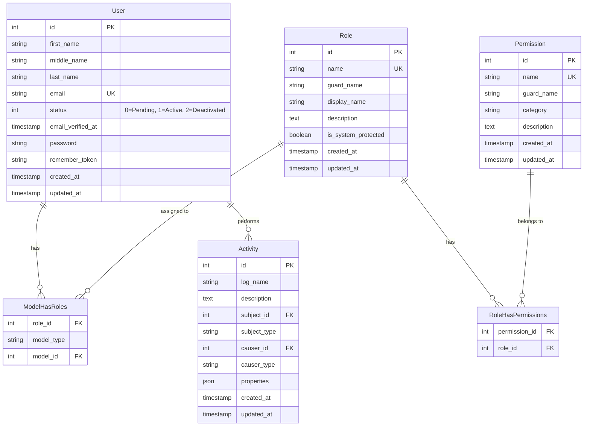
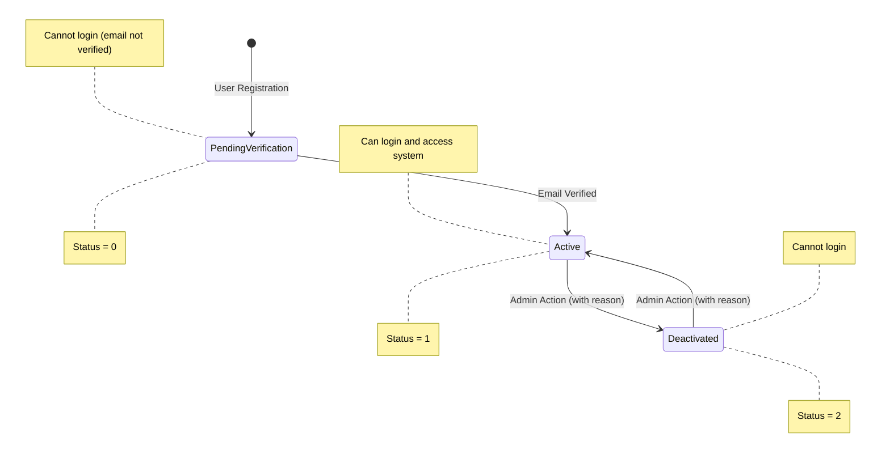
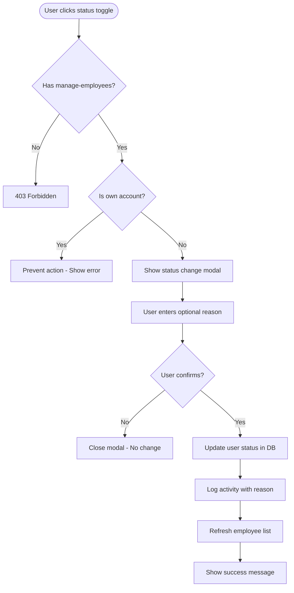

# Phase 1: Data Model

**Feature**: Employee Management & Sidebar Navigation  
**Date**: March 7, 2026  
**Status**: Complete

## Entity Relationship Diagram



## Entity Descriptions

### User (Existing Model - No Modifications)

**Purpose**: Represents employees/users in the system. Primary entity for employee management feature.

**Attributes**:
- `id`: Primary key (auto-increment)
- `first_name`: Employee's first name (required, string 255)
- `middle_name`: Employee's middle name (nullable, string 255)
- `last_name`: Employee's last name (required, string 255)
- `email`: Unique email address (required, string 255, unique index)
- `status`: Account status (integer: 0=Pending Verification, 1=Active, 2=Deactivated)
- `email_verified_at`: Email verification timestamp (nullable)
- `password`: Hashed password (required, string 255)
- `remember_token`: Laravel session token (nullable, string 100)
- `created_at`: Record creation timestamp
- `updated_at`: Record modification timestamp

**Relationships**:
- `belongsToMany(Role)` via `model_has_roles` table (Spatie Permission)
- `morphMany(Activity)` via `activities` table as causer (Spatie Activity Log)
- `morphMany(Activity)` via `activities` table as subject (Spatie Activity Log)

**Validation Rules**:
- `first_name`: required, string, max:255
- `middle_name`: nullable, string, max:255
- `last_name`: required, string, max:255
- `email`: required, email, max:255, unique:users,email
- `status`: required, integer, in:0,1,2

**Indexing**:
- Primary key: `id`
- Unique index: `email`
- Composite index: `first_name, last_name` (for search performance)

**Casts**:
```php
protected function casts(): array
{
    return [
        'email_verified_at' => 'datetime',
        'password' => 'hashed',
        'status' => 'integer',
    ];
}
```

### Permission (Existing Model - No Modifications)

**Purpose**: Defines granular permissions for access control. Used to restrict employee management features.

**Key Permissions for This Feature**:
- `view-employees`: Read access to employee list
- `manage-employees`: Edit access for status changes

**Attributes**:
- `id`: Primary key
- `name`: Permission identifier (e.g., "view-employees")
- `guard_name`: Authentication guard (always "web")
- `category`: Grouping for UI display (e.g., "Employee Management")
- `description`: Human-readable explanation
- `created_at`, `updated_at`: Timestamps

**Already Seeded**: Both permissions exist in `database/seeders/PermissionSeeder.php`

### Role (Existing Model - No Modifications)

**Purpose**: Groups permissions into assignable roles. Displayed in employee list.

**Attributes**:
- `id`: Primary key
- `name`: Role identifier (e.g., "administrator")
- `guard_name`: Authentication guard ("web")
- `display_name`: Human-readable name (e.g., "Administrator")
- `description`: Role purpose explanation
- `is_system_protected`: Prevents deletion (boolean)
- `created_at`, `updated_at`: Timestamps

**Relationships**:
- `belongsToMany(Permission)` via `role_has_permissions`
- `belongsToMany(User)` via `model_has_roles`

### Activity (Existing Model - No Modifications)

**Purpose**: Audit trail for all user actions. Records every status change with optional reason.

**Attributes**:
- `id`: Primary key
- `log_name`: Log category (e.g., "employee-management")
- `description`: Action description (e.g., "employee_status_changed")
- `subject_id`: ID of affected entity (User ID)
- `subject_type`: Model class (App\Models\User)
- `causer_id`: ID of user performing action
- `causer_type`: Model class of actor
- `properties`: JSON field storing additional data (reason, old_status, new_status)
- `created_at`, `updated_at`: Timestamps

**Example Properties JSON**:
```json
{
  "old_status": 1,
  "new_status": 2,
  "reason": "Employee resignation - last day 2026-03-15"
}
```

## State Diagram: Employee Status



## Data Flow Diagram: Status Change Workflow



## Database Schema Changes

**None Required** - All necessary tables and columns already exist:
- `users` table has `status` column
- `permissions` table has required permissions seeded
- `roles` and pivot tables exist via Spatie Permission
- `activities` table exists via Spatie Activity Log

## Query Performance Considerations

### Employee List Query (Critical Path)

```sql
-- Expected query with eager loading
SELECT * FROM users 
    WHERE (
        first_name LIKE '%search%' OR 
        middle_name LIKE '%search%' OR 
        last_name LIKE '%search%' OR 
        email LIKE '%search%'
    )
    AND status = 1
    LIMIT 15 OFFSET 0;

-- Role eager loading
SELECT roles.*, model_has_roles.model_id 
FROM roles 
INNER JOIN model_has_roles ON roles.id = model_has_roles.role_id
WHERE model_has_roles.model_id IN (1, 2, 3, ...15);
```

**Performance Targets**:
- Primary query: <100ms for 1000 records
- Role eager load: <50ms for 15 users
- Total page load: <2 seconds

**Optimization Strategy**:
- Existing indexes on `users.email` and name columns
- Pagination limits result set to 15 records
- Eager loading prevents N+1 queries for roles
- Status filter uses indexed `status` column

### Activity Log Query

```sql
-- Fetch status change history for a user
SELECT * FROM activities
WHERE subject_type = 'App\\Models\\User'
    AND subject_id = ?
    AND description = 'employee_status_changed'
ORDER BY created_at DESC
LIMIT 50;
```

**Performance**: Non-critical path (used for audit review, not primary workflow). Indexed on `subject_type` and `subject_id`.

## Data Integrity Constraints

1. **Email Uniqueness**: Enforced at database level (unique index) and application level (validation)
2. **Status Values**: Application-level validation ensures only 0, 1, or 2 allowed
3. **Activity Immutability**: Spatie Activity Log prevents modification of logged activities
4. **Permission Enforcement**: All status changes validated via Spatie Permission gates
5. **Self-Protection**: Business logic prevents users from modifying their own status

## Migration Strategy

**Not Applicable** - No database migrations needed for this feature. All schema elements already exist from previous features:
- Users table: Created in initial Laravel migration
- Permissions/Roles tables: Created by Spatie Permission package
- Activities table: Created by Spatie Activity Log package

## Rollback Considerations

**Data Rollback**: If feature needs to be reverted:
1. Activity logs remain intact (audit trail preserved)
2. No data cleanup needed
3. Remove route and Livewire component files only
4. User status remains unchanged (no migration to revert)

## Data Validation

### Status Change Validation

```php
// Livewire component validation
public function updateStatus(User $user, int $newStatus): void
{
    // Business logic validation
    if ($user->id === auth()->id()) {
        throw new \Exception('Cannot modify own status');
    }
    
    // Authorization check
    $this->authorize('manage-employees');
    
    // Status value validation
    if (!in_array($newStatus, [0, 1, 2])) {
        throw new \InvalidArgumentException('Invalid status value');
    }
    
    $oldStatus = $user->status;
    $user->update(['status' => $newStatus]);
    
    // Audit logging
    activity()
        ->performedOn($user)
        ->withProperties([
            'old_status' => $oldStatus,
            'new_status' => $newStatus,
            'reason' => $this->statusChangeReason,
        ])
        ->log('employee_status_changed');
}
```

## Summary

**Data Complexity**: Low - Leverages existing schema without modifications

**Key Entities**: 4 (User, Role, Permission, Activity)

**New Tables**: 0

**Modified Tables**: 0

**Critical Relationships**: User ↔ Role (many-to-many), User ↔ Activity (one-to-many)

**Performance Risk**: Low - Proper indexing and eager loading strategies in place
