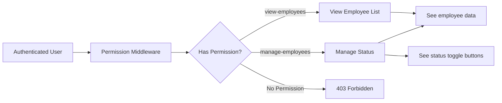

# Developer Quickstart Guide

**Feature**: Employee Management & Sidebar Navigation  
**Branch**: `003-employee-management-sidebar`  
**Prerequisites**: Completed authentication and role management features

## Getting Started (5 minutes)

### 1. Switch to Feature Branch

```bash
git checkout 003-employee-management-sidebar
```

### 2. Verify Environment

```bash
# Check database connection
php artisan migrate:status

# Verify permissions are seeded
php artisan tinker
>>> Permission::whereIn('name', ['view-employees', 'manage-employees'])->get();
# Should return 2 permissions

# Verify Flux UI is installed
composer show livewire/flux
# Should show version ^2.9.0
```

### 3. Run Existing Tests (Baseline)

```bash
php artisan test --compact
# Expected: 41 tests passing from previous features
```

## Architecture Overview

### Component Structure

```
User Request
    ↓
Route (web.php) → Permission Middleware
    ↓
Livewire Component (ManageEmployees.php)
    ↓
    ├─→ Computed Property (employees())
    │       ↓
    │   Eloquent Query → Database
    │
    ├─→ Action Method (updateStatus())
    │       ↓
    │   User Model Update → Activity Log
    │
    └─→ Blade View (manage-employees.blade.php)
            ↓
        Flux UI Components → Browser
```

### Permission Flow



## Key Files & Responsibilities

### Core Implementation Files

| File | Purpose | Lines (est.) |
|------|---------|--------------|
| `app/Livewire/Employees/ManageEmployees.php` | Main component logic | ~150 |
| `resources/views/livewire/employees/manage-employees.blade.php` | UI template | ~180 |
| `resources/views/layouts/app.blade.php` | Sidebar navigation | ~120 |
| `routes/web.php` | Route definition | +5 |

### Test Files (TDD Approach)

| File | Coverage | Tests (est.) |
|------|----------|--------------|
| `tests/Feature/EmployeeListTest.php` | Employee viewing, search, filter | 8 tests |
| `tests/Feature/EmployeeStatusTest.php` | Status management, permissions | 6 tests |
| `tests/Feature/SidebarNavigationTest.php` | Navigation UI | 5 tests |
| `tests/Unit/Livewire/ManageEmployeesTest.php` | Component methods | 4 tests |

## Development Workflow (TDD)

### Step 1: Write Failing Tests

```bash
# Create test file
php artisan make:test Feature/EmployeeListTest

# Run tests (should fail)
php artisan test --filter=EmployeeListTest
```

### Step 2: Implement Feature

```bash
# Create Livewire component
php artisan make:livewire Employees/ManageEmployees

# Edit component and view
# (See implementation details in tasks.md)
```

### Step 3: Verify Tests Pass

```bash
# Run specific tests
php artisan test --filter=EmployeeListTest

# Run all tests
php artisan test --compact
```

### Step 4: Code Style Check

```bash
# Auto-fix code style
vendor/bin/pint --format agent
```

## Common Development Tasks

### Testing Employee List Locally

```bash
# Create test users with roles
php artisan tinker
>>> $admin = User::factory()->create();
>>> $admin->assignRole('administrator');
>>> User::factory()->count(20)->create();

# Log in as admin and visit http://localhost:8000/employees
```

### Testing Status Change

```bash
php artisan tinker
>>> $user = User::find(2);
>>> $user->status; // Check current status
>>> $user->update(['status' => 2]); // Deactivate
>>> Activity::where('subject_id', 2)->latest()->first(); // Check audit log
```

### Debugging Livewire Components

```php
// Add to ManageEmployees component
public function mount()
{
    logger('Component mounted', [
        'user' => auth()->id(),
        'permissions' => auth()->user()->getAllPermissions()->pluck('name')
    ]);
}

// Check logs
tail -f storage/logs/laravel.log
```

### Inspecting Flux UI Components

```bash
# View available Flux components
ls vendor/livewire/flux/src/Components/

# View component documentation
# Visit: https://flux.laravel.com/components
```

## Environment Variables (Already Configured)

No new environment variables needed. Existing configuration sufficient:

```dotenv
DB_CONNECTION=sqlite                    # Using SQLite for development
QUEUE_CONNECTION=database               # Synchronous queue processing
SESSION_DRIVER=database                 # Persistent sessions
```

## Testing Checklist

Before submitting PR, verify:

- [ ] All existing tests still pass (41 tests)
- [ ] New feature tests cover happy paths
- [ ] New feature tests cover error cases
- [ ] Permission checks tested (with/without permissions)
- [ ] Self-protection tested (cannot deactivate own account)
- [ ] Activity logging tested (reason captured)
- [ ] Code style passes (`vendor/bin/pint --format agent`)
- [ ] No N+1 queries (check with Laravel Debugbar)
- [ ] Browser test for sidebar navigation passes

## Performance Testing

```bash
# Install Laravel Debugbar (dev dependency)
composer require barryvdh/laravel-debugbar --dev

# Create 1000 test users
php artisan tinker
>>> User::factory()->count(1000)->create();

# Visit /employees and check Debugbar:
# - Query count should be 2 (employees + roles)
# - Page load should be <2 seconds
```

## Troubleshooting

### Issue: "Permission denied" when accessing /employees

**Solution**: Verify user has `view-employees` permission

```bash
php artisan tinker
>>> auth()->user()->givePermissionTo('view-employees');
```

### Issue: Status toggle button not showing

**Solution**: Verify user has `manage-employees` permission

```bash
php artisan tinker
>>> auth()->user()->givePermissionTo('manage-employees');
```

### Issue: Sidebar not showing FDC logo

**Solution**: Verify logo file exists

```bash
ls -la public/images/fdc.png
# If missing: copy logo to public/images/
```

### Issue: Livewire component not updating

**Solution**: Clear Livewire cache

```bash
php artisan livewire:clear
php artisan view:clear
```

## Useful Commands Reference

```bash
# Run specific test class
php artisan test --filter=EmployeeListTest

# Run tests with coverage
php artisan test --coverage

# Watch tests (requires --watch flag)
php artisan test --watch

# Inspect Livewire routes
php artisan route:list --path=livewire

# Clear all caches
php artisan optimize:clear

# Generate IDE helper (for better autocomplete)
php artisan ide-helper:generate
```

## Next Steps

1. Read [data-model.md](data-model.md) for database schema details
2. Read [tasks.md](tasks.md) for granular implementation checklist (created by `/speckit.tasks`)
3. Start with failing tests as per TDD approach
4. Implement features incrementally
5. Run `vendor/bin/pint` before committing

## Support Resources

- **Laravel 12 Docs**: https://laravel.com/docs/12.x
- **Livewire 4 Docs**: https://livewire.laravel.com/docs/
- **Flux UI Docs**: https://flux.laravel.com/
- **Spatie Permission Docs**: https://spatie.be/docs/laravel-permission/
- **Spatie Activity Log Docs**: https://spatie.be/docs/laravel-activitylog/
- **Project Constitution**: [.specify/memory/constitution.md](../../../.specify/memory/constitution.md)

## Time Estimates

| Task | Estimated Time |
|------|----------------|
| Environment setup & verification | 15 minutes |
| Write failing tests | 2 hours |
| Implement Livewire component | 3 hours |
| Implement Blade views | 2 hours |
| Implement sidebar navigation | 1 hour |
| Fix failing tests | 2 hours |
| Code review & refinement | 1 hour |
| **Total** | **11-12 hours** |

---

**Ready to Start?** Run `git status` to confirm you're on `003-employee-management-sidebar` branch, then proceed to write your first test!
